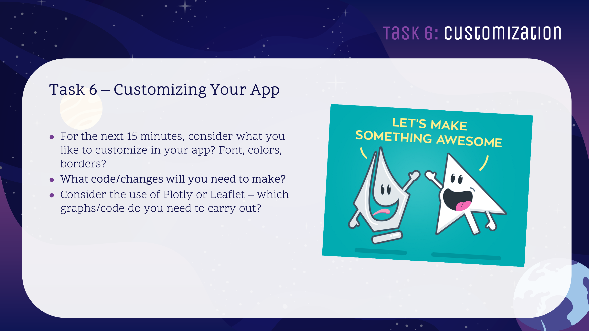

---

---
<style>
@import url('https://fonts.googleapis.com/css?family=Scope+One&display=swap');
@import url('https://fonts.googleapis.com/css?family=Scope+One|Unica+One&display=swap&subset=latin-ext');
@import url('https://fonts.googleapis.com/css?family=Open+Sans&display=swap');

h1,h2 {font-family: 'Unica One', cursive;
  font-size: 25px;}
p2 {font-family: 'Unica One', cursive;
  font-size: 25px;}     
p3 {font-family: 'Unica One', cursive;
  font-size: 20px;}       
p {font-family: 'Open Sans', sans-serif;
  font-size: 15px;}     
</style>
  ```{r setup, include=FALSE}
knitr::opts_chunk$set(echo = TRUE)
```
&nbsp;    


# Customisation {.tabset .tabset-fade}  

## Intro  
&nbsp;  
<p3>So we have created an app. It works and has all the components you need..but it still looks a bit...</p3>

<center>
<iframe src="https://giphy.com/embed/11d6avgEFTqmBO" width="200" height="183" frameBorder="0" class="giphy-embed" allowFullScreen></iframe>
</center>
<p2>So what do we do??</p2>  

<p>Fortunately we have several options available in Shiny that can change the appear ance of your app. For example: 
<ul>
<li>HTML/CSS</li>
<li>Shiny Themes</li>
<li>Javascript</li>
</ul>

Today we're only going to cover the first two options.</p>

## HTML/CSS  
&nbsp;  
<p>The following section aims to show you how HTML and CSS are used in Shiny and how you can use it without having to become a full-blown website developer.<p>

<center>
<iframe src="https://4mosteurope.sharepoint.com/sites/traininganddevelopment/_layouts/15/Doc.aspx?sourcedoc={efbfce59-1156-4043-87a3-f574f0298761}&amp;action=embedview&amp;wdAr=1.7777777777777776" width="962px" height="565px" frameborder="0">This is an embedded <a target="_blank" href="https://office.com">Microsoft Office</a> presentation, powered by <a target="_blank" href="https://office.com/webapps">Office</a>.</iframe>
</center>
&nbsp; 

<p>The following RStudio site describes the use of the HTML tags quite well. So if you want to use the tags in your app today, [please check it out](https://shiny.rstudio.com/articles/tag-glossary.html).</p>
<center>
<iframe width="100%" height="750" src="https://shiny.rstudio.com/articles/tag-glossary.html" scrolling= "yes"></iframe>  
</center> 


<br><br>
<p2>CSS</p2>
<br>
<p>You can add custom CSS to your app by creating a www/ subdirectory to your app and adding a CSS file there. Suppose, for example, you want to change the title font of your dashboard to the same font as the rest of the dashboard, so that it looks like this:</p>
<center>

</center><br>
<p>To do this, first create a file named www/custom.css with the following:</p>
```{css eval=FALSE, include=TRUE}
.main-header .logo {
  font-family: "Georgia", Times, "Times New Roman", serif;
  font-weight: bold;
  font-size: 16px;
}
```

<p>Then refer to that CSS file from the UI of your app:</p>
```{r eval=FALSE, include=TRUE}
## ui.R ##
dashboardPage(
  dashboardHeader(title = "Custom font"),
  dashboardSidebar(),
  dashboardBody(
    tags$head(
      tags$link(rel = "stylesheet", type = "text/css", href = "custom.css")
    )
  )
)
```


## Resources
&nbsp;  

<p2>Determining colors</p2>
<br>
[color Picker](https://imagecolorpicker.com/)
<p>This site allows you to upload images and pick the color of the part of the image that you wish to reproduce. This is helpful if you want to use the color of a particular client's logo but don't know how to match it exactly. This site will provide the exact hex # for the color.coolo</p>
<br>

<p2>Palette Assistance</p2>
<br>
[Coolors](https://coolors.co/)
<p>Want to create a palette of colors to ensure your app is consistent, professional and looks good? This website allows you to choose a color and will provide a palettes that go with your color.</p>
<br>

<p2>Shiny Themes</p2>
<br>
[Shiny Themes](https://rstudio.github.io/shinythemes/)
<p>This package allows you to apply a set theme to your app which can improve the look of your app very quickly! Please note - you will be limited to the themes included in the package.</p>
<br>

<p2>Google Fonts API</p2>
<br>
[Google Fonts API](https://fonts.google.com/)
<p>Want to include interesting fonts that are not built into your machine? The google fonts api has hundreds of free fonts that you can include in your app with very little coding and no downloads!</p>
<br>

<p2>Canva</p2>
<br>
[Canva](https://www.canva.com/)
<p>A powerful graphic design tool with a free and paid option. This is very easy to use and requires no real graphic design knowledge. They also provide dozens of templates, photos, graphic elements and more. So if you'd like to add some custom images, slides or even create your own logo - check out Canva.</p>
<br>

<p2>w3 - HTML/CSS/JS Help</p2>
<br>
[w3schools](https://www.w3schools.com/)
<p>Recommended for reference material on CSS styling (and HTML and other useful web related syntax). A lot of their descriptions include interactive examples that you can manipulate yourself to really understand how something works. Also check out the following app: [HTML and Text](https://iheart.shinyapps.io/shinyMCE-01-basic/)</p>
<br>


<p2>Curated List of Design Tools</p2>
<br>
[Awesome Design Tools](https://flawlessapp.io/designtools)
<p>This site is well regarded curated list of top design and graphic tools that may assist you in the design of your app. So if you can't find it elsewhere, look here.</p>
<br>

## Checkpoint 8
&nbsp;  

<center>

</center>

&nbsp;  
