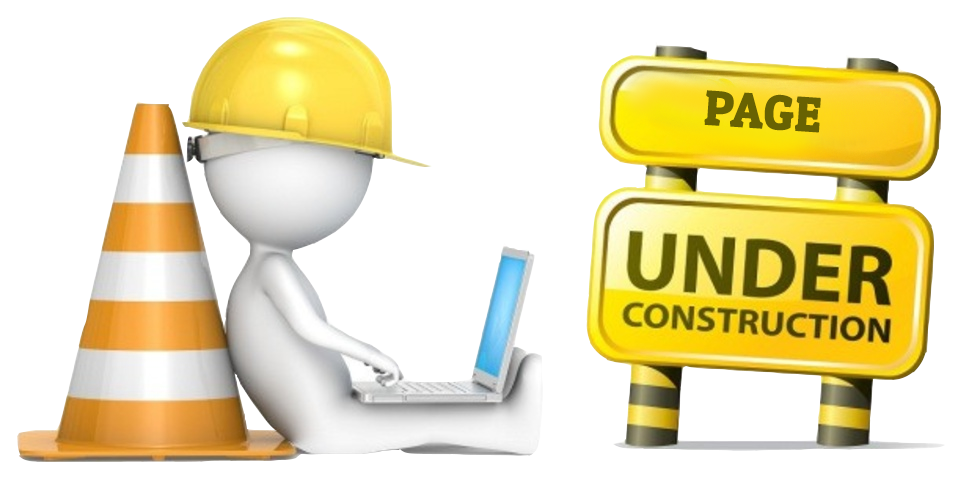

---

---
<style>
@import url('https://fonts.googleapis.com/css?family=Scope+One&display=swap');
@import url('https://fonts.googleapis.com/css?family=Scope+One|Unica+One&display=swap&subset=latin-ext');
@import url('https://fonts.googleapis.com/css?family=Open+Sans&display=swap');

h1,h2 {font-family: 'Unica One', cursive;
  font-size: 25px;}
p2 {font-family: 'Unica One', cursive;
  font-size: 25px;}       
p {font-family: 'Open Sans', sans-serif;
  font-size: 15px;}   
</style>
  ```{r setup, include=FALSE}
knitr::opts_chunk$set(echo = TRUE)
```
&nbsp;   


# Data Visualization {.tabset .tabset-fade}  

## Intro  

&nbsp;  

<p2>SECTION UNDER CONSTRUCTION - NOT READY</p2>
<br>
<center>
<div style="width:50%; height:30%">

</center>
<br>


<p2>Data Visualization</p2>
<br><br>
<p>No, we're not designers but consider the following situation: You've built a beautiful model after a lot of effort and time and now it's time to present it to your stakeholders. How many of you actually end up using the standard SAS graph outputs?? I'm willing to bet very of you do. 
Standard practice tends to be to bring data into Excel when it comes to visualization. And why is that?</p>
<p>The aim of this section is to give you a grounding in how to best visualize data when presenting data in both static and dynamic formats.</p>

<center>
<iframe src="https://4mosteurope.sharepoint.com/sites/traininganddevelopment/_layouts/15/Doc.aspx?sourcedoc={0b840175-f723-413c-9110-16496397426b}&amp;action=embedview&amp;wdAr=1.7777777777777776" width="962px" height="565px" frameborder="0">This is an embedded <a target="_blank" href="https://office.com">Microsoft Office</a> presentation, powered by <a target="_blank" href="https://office.com/webapps">Office</a>.</iframe>
</center>

&nbsp;  

## Basic Principles    

&nbsp;  

## Cognition  

&nbsp;  

## Resources  

&nbsp;  

## Practice    

&nbsp;  

## Checkpoint    

&nbsp;

## Inspiration  

&nbsp;
