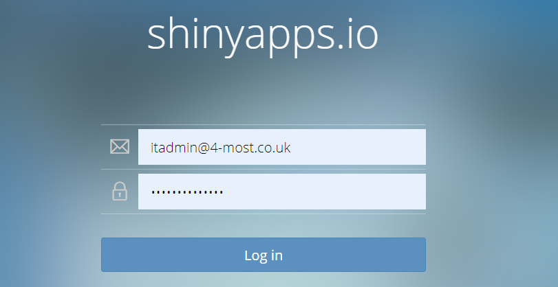
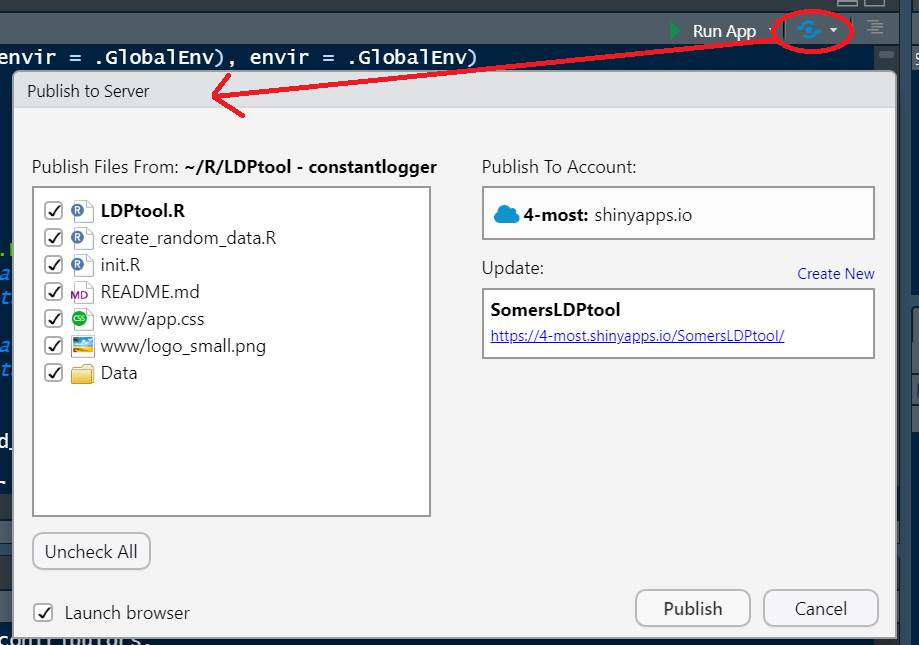

---

---
<style>
@import url('https://fonts.googleapis.com/css?family=Scope+One&display=swap');
@import url('https://fonts.googleapis.com/css?family=Scope+One|Unica+One&display=swap&subset=latin-ext');
@import url('https://fonts.googleapis.com/css?family=Open+Sans&display=swap');

h1,h2 {font-family: 'Unica One', cursive;
      font-size: 25px;}
p2 {font-family: 'Unica One', cursive;
      font-size: 25px;}       
p {font-family: 'Open Sans', sans-serif;
      font-size: 15px;}      
</style>
```{r setup, include=FALSE}
knitr::opts_chunk$set(echo = TRUE)
```
&nbsp;    


<p2>Deployment Walkthrough</p2>
&nbsp;  

<p>
4most pays for hosting services provided by RStudio through their [shinyapps.io](https://www.shinyapps.io/) platform. There is an available 'basic' plan that will allow you to publish for free (limited number of apps and time). Simply create an account and you can start publishing your app in a jiffy!
</p>

<p2>Steps to Publishing</p2>
&nbsp;  

<p>Create an account and login- Select your username with care, as it will be part of the URL in all of your apps.</p>
<center>
<div style="width:50%; height:30%">

</div>
</center>
<br>
<p>Install the `rsconnect` package if it hasn't been included in your RStudio setup.</p>

<p>[shinyapps.io](https://www.shinyapps.io/) interface has a ‘tokens’ section. This can be used to configure your RStudio session to interact with the shinyapps.io platform. Copy the token and paste it into the Console in RStudio. You will only need to do this once per computer. Once a token has been used to configure your RStudio session, the publish feature can be used to publish your app onto the platform.</p>

<p>Run your finished Shiny app in RStudio, press the publish button as illustrated below and select any folders and files you would need to run your app in the wizard. An automatic process will upload the selected files and may take some time to upload.</p>
<br>
<center>
<div style="width:50%; height:30%">

</div>
</center>
<br>
<p> </p>


