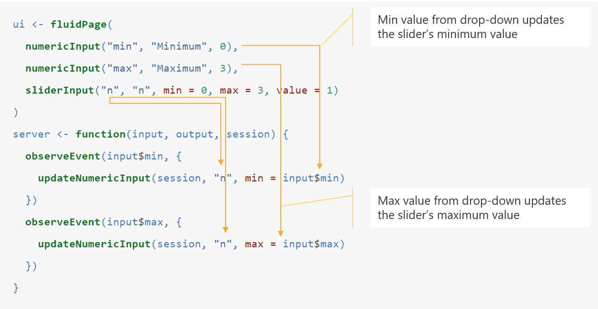

---

---
<style>
@import url('https://fonts.googleapis.com/css?family=Scope+One&display=swap');
@import url('https://fonts.googleapis.com/css?family=Scope+One|Unica+One&display=swap&subset=latin-ext');
@import url('https://fonts.googleapis.com/css?family=Open+Sans&display=swap');

h1,h2 {font-family: 'Unica One', cursive;
  font-size: 25px;}
p2 {font-family: 'Unica One', cursive;
  font-size: 25px;}       
p {font-family: 'Open Sans', sans-serif;
  font-size: 15px;}   
</style>
```{r setup, include=FALSE}
knitr::opts_chunk$set(echo = TRUE)
```
&nbsp;    


# Dynamic UI {.tabset .tabset-fade}  

## Intro to Dynamic UIs
&nbsp;  
<p>Using what you know about reactivity, learn how to make your UI dynamic! A dynamic UI is for when we want to add, remove or change the currently loaded widets based on the dynamic changes or user input. For instance: </p>
<ul>
<li><p>Display certain parts of the user interface if a certain condition is met </p></li>
<li><p>Display or hide aparts of the user interface when a certain condition is met</p></li>
<li><p>Modify the parameters of input control widgets.</p></li>
</ul>  
<p>Keep the following shiny functions in mind: `conditionalPanel( )`, `uiOutput( )/renderUI( )`, `insertUI( )` or `removeUI`.</p>
<p>**Let's go through these key UI changes in the tabs above.**</p>
<br>

<p2>Example: Dynamic UI</p2>
<p>Still wondering what we're on about? Check out the following example and read through the subsequent code. The app displays a graph when a particular dataset is chosen:</p>

<center>
<iframe width="100%" height="475" src="https://g4most.shinyapps.io/dynamic_ex/" scrolling= "yes"></iframe>  
</center>  
<br>
```{r eval=FALSE, include=TRUE}
library(shiny)
library(datasets)

ui<-fluidPage(
  selectInput("data_input",label="Select data", 
              choices=c("mtcars","faithful","iris")), #dataset choices
  tableOutput("table_output"),
  uiOutput("ui")
)

server<-function(input,output) {
  getdata <- reactive({ get(input$data_input, 'package:datasets') })
  
  output$ui <- renderUI({
    #if the dataset is 'iris', display 'plot_output'
    if(input$data_input=="iris") plotOutput("plot_output",width="400px")
  })
  
  output$plot_output <- renderPlot({hist(getdata()[, 1])})
  output$table_output <- renderTable({head(getdata())})
}

shinyApp(ui = ui, server = server)

```


## Updating Inputs
&nbsp;

<p2>Modifying Inputs</p2>
<br><br>
<p>This topic refers to how to modify/update a control widget *after* it has already been created.</p>
<p>Consider the following possibility -> You've created an input widget listing a couple of datasets with different explanatory variables that can be used in a model. Now you would like the user to be able to choose the explanatory variables from a drop-down list after choosing the dataset from the first input widget. Because the choice of these variables is determined by the dataset chosen, you need to learn how to update the drop-down list based on the chosen dataset. </p>
<p>
<br>
<p2>The How?</p2>
<p>
Each control widget, such as `numericInput( )`, has a corresponding **update** counterpart, such as `updateNumericInput( )` that is used to create the dynamic behaviour described above. Whilst fairly similar to the original function, you will need to include an extra argument `session` to the update and will also use the name of the input as the second argument.</p>
<p>We're not goint to list every single update version of each control widget but feel free to checkout the following:</p>
<ul>
<li><p>[updateSelectInput( ) online documentation](https://shiny.rstudio.com/reference/shiny/1.2.0/updateSelectInput.html)</p></li>
<li><p>[updateCheckboxGroup( ) online documentation](https://shiny.rstudio.com/reference/shiny/1.2.0/updateCheckboxGroupInput.html)</p></li>
<li><p>[updateSliderInput( ) online documentation](https://shiny.rstudio.com/reference/shiny/latest/updateSliderInput.html)</p></li>
</ul>
<br>

<p2>Example 1: Updating Inputs (Dataset Example)</p2>
<br>
<p>In the example below, we are going to solve the scenario we first mentioned - producing a drop-down list of variable names that changes based on the input dataset chosen. </p>

```{r eval=FALSE, include=TRUE}
library(shiny)
library(datasets)
  
ui<-fluidPage(
  selectInput("inCheckboxGroup", #ID for first widget
              label="Select dataset",
              choices=c("mtcars","faithful","iris")), #Names of available datasets
  selectInput("inSelect", #ID for second widget
              "Select Variable",
              "Placeholder") #Widgets require a choice argument, add any text for to run without error
)

server <- function(input, output, session) {
    observe({    
      #Pulls the dataset chosen in first widget
      #Make the dataset choice reactive as the input and output will change
      #Feed it to the next step
      #x will be read as a function from here on out (i.e., use x( ) instead of x)
      x <- reactive({get(input$inCheckboxGroup)})

      #update will feed the 2nd widget with the variable names of x( )
      updateSelectInput(session, 
                        "inSelect",
                        choices = names(x())) 
                        #x() is reactive input giving shiny the chosen dataset name
                        #names( ) is standard R for pulling column names
  })}

shinyApp(ui, server)
```
<br>

<p2>Example 2: Updating Inputs</p2>
<br>
<p>In the example below, we want to update the slider values based on which values we've selected in the two drop-down lists.</p>

<center>
<div style="width:75%; height:50%">

Source: https://mastering-shiny.org/action-dynamic.html#updating-inputs
</center>
<br>
<p>For some more context:</p>
```{r eval=FALSE, include=TRUE}
#You will need to add session as an argument to the server (see below)

server <- function(input, output, session) {
  observeEvent(input$min, { #When change in input$min is observed, do --
    updateNumericInput(session,  #Used to identify different users of your app
                       "n",      #Updating slider with ID 'n'
                       min = input$min) #Updating the min value with reactive input
  })  
  observeEvent(input$max, { #When change in input$max is observed, do --
    updateNumericInput(session, #Used to identify different users of your app
                       "n",     #Updating slider with ID 'n'
                       max = input$max) #Updating the max value with reactive input
  })}

```
<br>

<center>
<iframe width="100%" height="475" src="https://hadley.shinyapps.io/ms-update-basics/" scrolling= "yes"></iframe>  
</center>  


## Dynamic Visibility
&nbsp;  

<p2>Selective display of the UI</p2>
<br><br>
<p>This next topic is all about how to selectively show or hide certain parts of the UI.</p>


## Creating UI
&nbsp;  

<p2>Selective display of the UI</p2>
<br><br>
<p>This next topic is all about how to selectively show or hide certain parts of the UI.</p>


## Checkpoint 5
&nbsp;  
