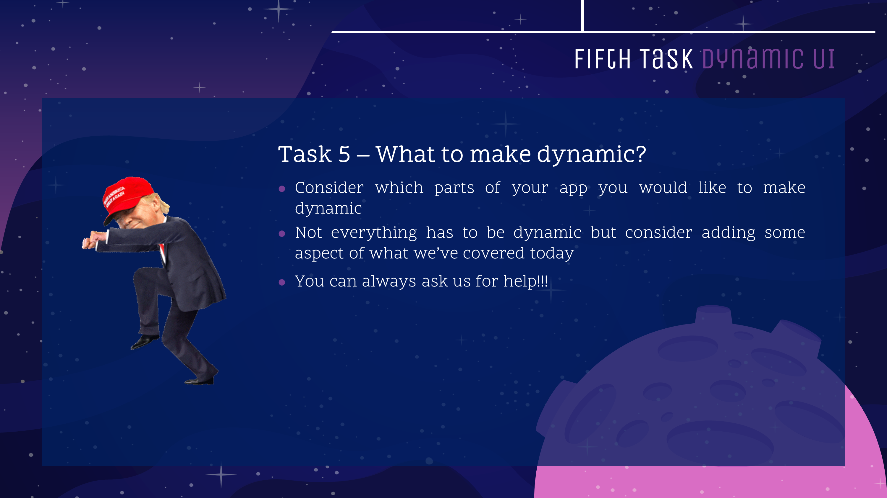

---

---
<style>
@import url('https://fonts.googleapis.com/css?family=Scope+One&display=swap');
@import url('https://fonts.googleapis.com/css?family=Scope+One|Unica+One&display=swap&subset=latin-ext');
@import url('https://fonts.googleapis.com/css?family=Open+Sans&display=swap');

h1,h2 {font-family: 'Unica One', cursive;
  font-size: 25px;}
p2 {font-family: 'Unica One', cursive;
  font-size: 25px;}       
p {font-family: 'Open Sans', sans-serif;
  font-size: 15px;}   
</style>
```{r setup, include=FALSE}
knitr::opts_chunk$set(echo = TRUE)
```
&nbsp;    


# Dynamic UI {.tabset .tabset-fade}  

## Intro to Dynamic UIs
&nbsp;  
<p>Using what you know about reactivity, learn how to make your UI dynamic! A dynamic UI is for when we want to add, remove or change the currently loaded widets based on the dynamic changes or user input. For instance: </p>
<ul>
<li><p>Display certain parts of the user interface if a certain condition is met </p></li>
<li><p>Display or hide aparts of the user interface when a certain condition is met</p></li>
<li><p>Modify the parameters of input control widgets.</p></li>
</ul>  
<p>Keep the following shiny functions in mind: `conditionalPanel( )`, `uiOutput( )/renderUI( )`, `insertUI( )` or `removeUI`.</p>
<p>**Let's go through these key UI changes in the tabs above.**</p>
<br>

<p2>Example: Dynamic UI</p2>
<p>Still wondering what we're on about? Check out the following example and read through the subsequent code. The app displays a graph when a particular dataset is chosen:</p>

<center>
<iframe width="100%" height="475" src="https://g4most.shinyapps.io/dynamic_ex/" scrolling= "yes"></iframe>  
</center>  
<br>
```{r eval=FALSE, include=TRUE}
library(shiny)
library(datasets)

ui<-fluidPage(
  selectInput("data_input",label="Select data", 
              choices=c("mtcars","faithful","iris")), #dataset choices
  tableOutput("table_output"),
  uiOutput("ui")
)

server<-function(input,output) {
  getdata <- reactive({ get(input$data_input, 'package:datasets') })
  
  output$ui <- renderUI({
    #if the dataset is 'iris', display 'plot_output'
    if(input$data_input=="iris") plotOutput("plot_output",width="400px")
  })
  
  output$plot_output <- renderPlot({hist(getdata()[, 1])})
  output$table_output <- renderTable({head(getdata())})
}

shinyApp(ui = ui, server = server)

```


## Updating Inputs
&nbsp;

<p2>Modifying Inputs</p2>
<br><br>
<p>This topic refers to how to modify/update a control widget *after* it has already been created.</p>
<p>Consider the following possibility -> You've created an input widget listing a couple of datasets with different explanatory variables that can be used in a model. Now you would like the user to be able to choose the explanatory variables from a drop-down list after choosing the dataset from the first input widget. Because the choice of these variables is determined by the dataset chosen, you need to learn how to update the drop-down list based on the chosen dataset. </p>
<p>
<br>
<p2>The How?</p2>
<p>
Each control widget, such as `numericInput( )`, has a corresponding **update** counterpart, such as `updateNumericInput( )` that is used to create the dynamic behaviour described above. Whilst fairly similar to the original function, you will need to include an extra argument `session` to the update and will also use the name of the first input as the second argument. The update logic does sit in the Server script.</p>
<p>We're not going to list every single update version of each control widget but feel free to checkout the following:</p>
<ul>
<li><p>[updateSelectInput( ) online documentation](https://shiny.rstudio.com/reference/shiny/1.2.0/updateSelectInput.html)</p></li>
<li><p>[updateCheckboxGroup( ) online documentation](https://shiny.rstudio.com/reference/shiny/1.2.0/updateCheckboxGroupInput.html)</p></li>
<li><p>[updateSliderInput( ) online documentation](https://shiny.rstudio.com/reference/shiny/latest/updateSliderInput.html)</p></li>
</ul>
<br>

<p2>Example 1: Updating Inputs (Dataset Example)</p2>
<br>
<p>In the example below, we are going to solve the scenario we first mentioned - producing a drop-down list of variable names that changes based on the input dataset chosen. Read through the code to understand how the update version of a control widget functions.</p>

```{r eval=FALSE, include=TRUE}
library(shiny)
library(datasets)
  
ui<-fluidPage(
  selectInput("inCheckboxGroup", #ID for first widget
              label="Select dataset",
              choices=c("mtcars","faithful","iris")), #Names of available datasets
  selectInput("inSelect", #ID for second widget
              "Select Variable",
              "Placeholder") #Widgets require a choice argument, add any text for to run without error
)

server <- function(input, output, session) {
    observe({    
      #Pulls the dataset chosen in first widget
      #Make the dataset choice reactive as the input and output will change
      #Feed it to the next step
      #x will be read as a function from here on out (i.e., use x( ) instead of x)
      x <- reactive({get(input$inCheckboxGroup)})

      #update will feed the 2nd widget with the variable names of x( )
      updateSelectInput(session, 
                        "inSelect",
                        choices = names(x())) 
                        #x() is reactive input giving shiny the chosen dataset name
                        #names( ) is standard R for pulling column names
  })}

shinyApp(ui, server)
```
<br>

<p2>Example 2: Updating Inputs</p2>
<br>
<p>In the example below, we want to update the slider values based on which values we've selected in the two drop-down lists.</p>

<center>
<div style="width:75%; height:50%">

Source: https://mastering-shiny.org/action-dynamic.html#updating-inputs
</center>
<br>
<p>For some more context:</p>
```{r eval=FALSE, include=TRUE}
#You will need to add session as an argument to the server (see below)

server <- function(input, output, session) {
  observeEvent(input$min, { #When change in input$min is observed, do --
    updateNumericInput(session,  #Used to identify different users of your app
                       "n",      #Updating slider with ID 'n'
                       min = input$min) #Updating the min value with reactive input
  })  
  observeEvent(input$max, { #When change in input$max is observed, do --
    updateNumericInput(session, #Used to identify different users of your app
                       "n",     #Updating slider with ID 'n'
                       max = input$max) #Updating the max value with reactive input
  })}

```
<br>

<center>
<iframe width="100%" height="475" src="https://hadley.shinyapps.io/ms-update-basics/" scrolling= "yes"></iframe>  
</center>  

<p2>Exercise Time!</p2>
<br>
<p>You have the following code in your server - A slider widget affects what value is shown in the numericInput widget (box with numeric value).</p2>
<p>What would you write in the server to update the widget?</p>
```{r eval=FALSE, include=TRUE}
ui<-fluidPage(
  fluidRow(
    column(3, wellPanel(
      h4("This input control needs to change the next input control"),
      sliderInput("control_num", #Input ID for widget 1
                  "This controls values:", 
                  min = 1, max = 20, value = 15) #Settings for input control
    )),
    column(3, wellPanel(
      #Need to update the values of this control (box displaying values from widget 1)
      numericInput("inNumber",  #Input ID for widget 2
                  "Number input:",
                   min = 1, max = 20, value = 5, step = 0.5)) #Initial settings
    )))
```
<br>
<div id="testing2" style="display:none;">
```{r eval=FALSE, include=TRUE}
function(input, output, clientData, session) {
  observe({
    c_num <- input$control_num #For simplicity but you can use input$control_num
    updateNumericInput(session, "inNumber", value = c_num)
  })
}
```
</div>

<button onclick="myFunction()"><p style="color:#696969">Only me if you've tried!</p></button>
<p id="demo2"></p>
<br>
<script>
function myFunction() {
  var x = document.getElementById("testing2").innerHTML;
  document.getElementById("demo2").innerHTML = x;
}
</script>


## Dynamic Visibility
&nbsp;  

<p2>Selective display of the UI</p2>
<br><br>
<p>This next topic is all about how to selectively show or hide certain parts of the UI. We will use Hadley Wickham's example to illustrate how this works in 2 key examples.</p>

>Consider the following first scenario:
>
>>You have 1 sidePanel with a control widget and 3 tabPanels with different content on each tab. The control widget determines which tab and, by extension, what content is displayed on the mainPanel. How can we make this happen?

<p>To illustrate: </p>
<center>
<iframe width="100%" height="400" src="https://hadley.shinyapps.io/ms-dynamic-panels" scrolling= "yes"></iframe>  
</center>  
<br>

<p>In order for this to work, you will need the following CSS code - `"#g_SWITCH { display:none; }"`. It is not necessary for you to know how this works quite yet - Just know that it applies a style (do not display) to the tabsetPanel.</p>

```{r eval=FALSE, include=TRUE}
ui <- fluidPage(
  tags$style("#g_SWITCH { display:none; }"), #Hides tabs not selected.
  #The hash is followed by the input ID your're applying the code to. 
  #Do not touch the rest of the CSS code.
  sidebarLayout(
    sidebarPanel(
      #Widget 1 -> 3 options using the IDs identifying the 3 tabs
      selectInput("controller", #Widget ID
                  "Show", 
                  #Choice of 3 tabs, added "panel" to match input IDs below
                  choices = paste0("panel", 1:3))
    ),
    mainPanel( #Not a widget but can still be used as an input function
      tabsetPanel(
        id = "g_SWITCH", #Input ID
        #Following are 3 tabs with content (only text in this instance)
        #Content will be displayed based on the choice of panel in widget 1
        tabPanel("panel1",           #Input ID for tab 1
                 "Panel 1 content"), #Content for tab 1
        tabPanel("panel2",           #Input ID for tab 2
                 "Panel 2 content"), #Content for tab 2
        tabPanel("panel3",           #Input ID for tab 3
                 "Panel 3 content")  #Content for tab 3
      ))
  ))

server <- function(input, output, session) {
  observeEvent(input$controller, {
    updateTabsetPanel(session, 
                      "g_SWITCH", #Update the tabsetPanel with ID 'g_SWITCH'
                      selected = input$controller) 
                      #The tab chosen is dictated by which choice in widget 1 was selected
  })}
```
<br>

<p2>Displaying New Control Widgets</p2>
<br><br>
<p>Unlike the example in the previous tab (Updating Widgets), this topic is about displaying different types of control widgets based on whatever input you may have chosen.</p>

>Consider the second scenario:
>
>><p>You have one datset but would like to apply different statistical models and potentially evaluate their accuracy using different metrics. However, you don't want to create an app for each type of model that you would like to run and you don't want to create a visible tab for each model. Not only do you want to run different types of models, but each type of model will also need different controls. For instance:</p>
<ul><li><p>A Decision Tree model can be constrained by limiting the maximum depth and the minimum number of observations needed for a split.</p></li>
<li><p>What about running Logistic Regression on the same sample but wanting to use an L1 rather than an L2 penalty?</p></li>
<li><p>A KNN model can be tuned by determining how many neighbours you're looking at.</p></li></ul>
>>Each of these models would have different parameters that a user may want to change. How do we make this happen?


<p>To illustrate what you could potentially do, we're going to use Hadley Wickham's following example It's simpler than the scenario we've mentioned but the same process and logic applies. Careful though! Even a simple example can get complex quickly.</p>

<center>
<iframe width="100%" height="450" src="https://hadley.shinyapps.io/ms-dynamic-conditional/" scrolling= "yes"></iframe>  
</center>  
<br>

```{r eval=FALSE, include=TRUE}
#Code created outside of the main UI. It is then called in the UI (to make code clearer).
#Think of this like calling a macro inside of another
parameter_tabs <- tagList(
  tags$style("#params { display:none; }"), #Set to not appear as in previous example
  #Places different input control widgets (based on distribution) on different tabs
  tabsetPanel(id = "params",
    tabPanel("normal",
      numericInput("mean", "mean", value = 1),
      numericInput("sd", "standard deviation", min = 0, value = 1)),
    tabPanel("uniform", 
      numericInput("min", "min", value = 0),
      numericInput("max", "max", value = 1)),
    tabPanel("exponential",
      numericInput("rate", "rate", value = 1, min = 0),)
))

#UI Code
ui <- fluidPage(
  sidebarLayout(
    sidebarPanel(
      selectInput("dist", #Input ID that is sent to the server 
                  "Distribution", 
                  choices = c("normal", "uniform", "exponential")),
      numericInput("n", 
                  "Number of samples", 
                  value = 100),
      #Essentially you are creating tabs inside of the side panel that appear based on your selected dist.
      parameter_tabs, ), 
    mainPanel(
      plotOutput("hist")) #displays the graph
))

#Server Code
server <- function(input, output, session) {
  observeEvent(input$dist, {#Update the tabPanels with input controls based on distribution chosen
    updateTabsetPanel(session, "params", selected = input$dist) }) 
  
  sample <- reactive({ 
    #produces the distribution chosen from above
    #the sample will then be called by the renderPlot which is displayed by the UI
    switch(input$dist,
          normal = rnorm(input$n, input$mean, input$sd),
          uniform = runif(input$n, input$min, input$max),
          exponential = rexp(input$n, input$rate))})
  
  output$hist <- renderPlot(hist(sample()))
}
```
<br>


## Creating UI 
&nbsp;  

<p2>Selective display of the UI</p2>
<br><br>
<p>
This next topic is all about how to selectively show or hide certain parts of the UI.
</p>

<br>

## Checkpoint 5
&nbsp;  

<center>

</center>
