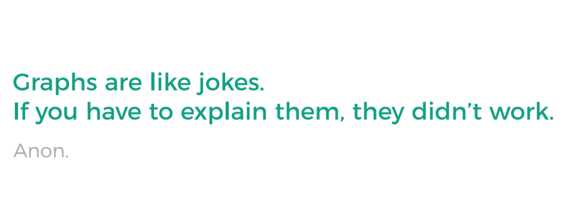
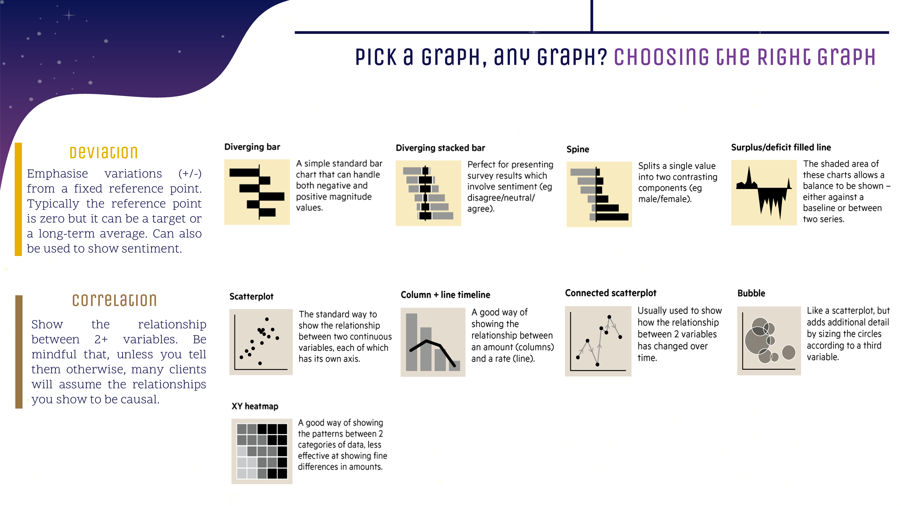
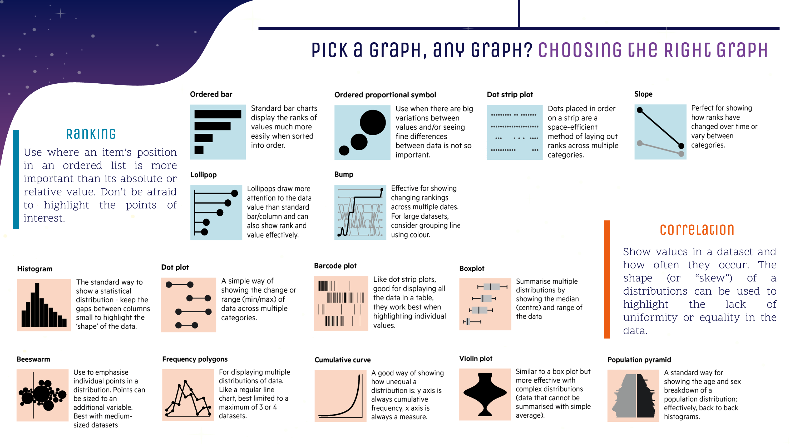
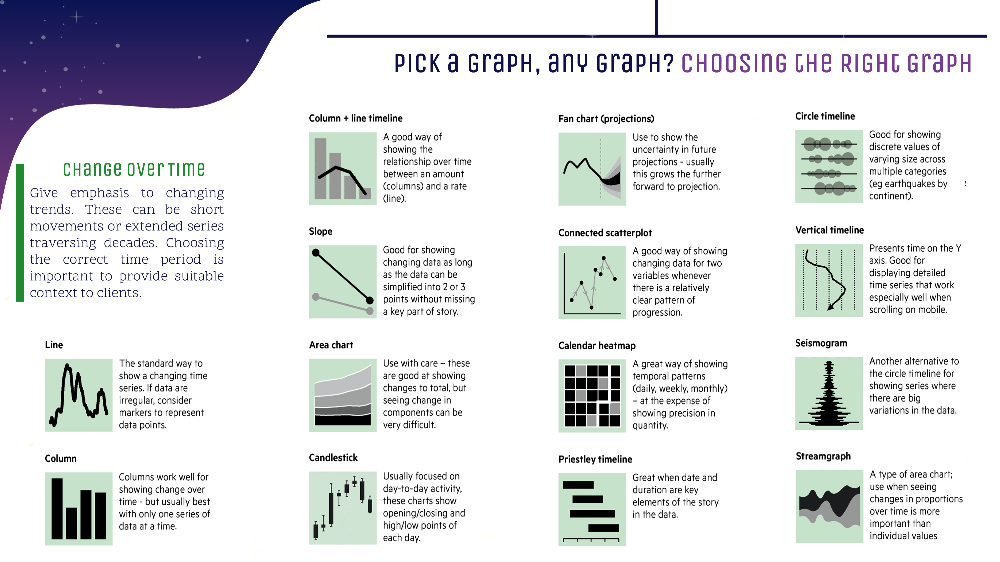
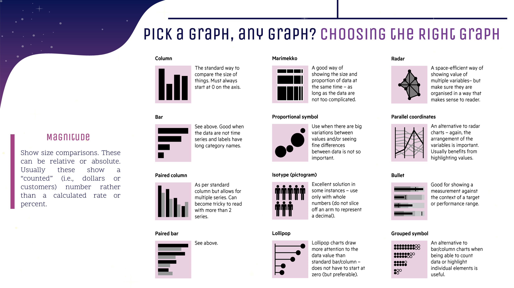
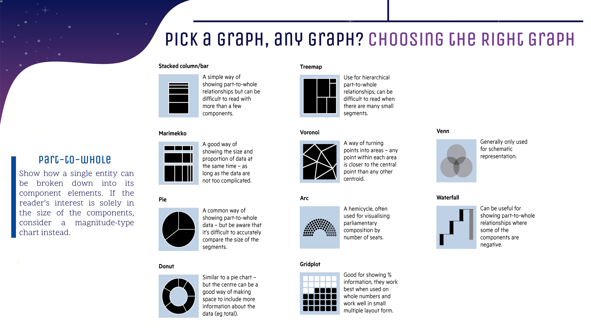
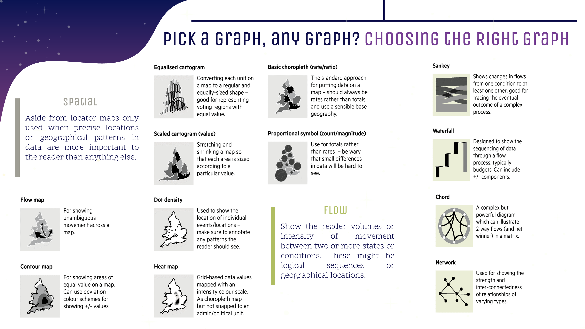

---

---
<style>
@import url('https://fonts.googleapis.com/css?family=Scope+One&display=swap');
@import url('https://fonts.googleapis.com/css?family=Scope+One|Unica+One&display=swap&subset=latin-ext');
@import url('https://fonts.googleapis.com/css?family=Open+Sans&display=swap');

h1,h2 {font-family: 'Unica One', cursive;
  font-size: 25px;}
p2 {font-family: 'Unica One', cursive;
  font-size: 25px;}       
p {font-family: 'Open Sans', sans-serif;
  font-size: 15px;}   
</style>
  ```{r setup, include=FALSE}
knitr::opts_chunk$set(echo = TRUE)
```
&nbsp;     


# Graphs {.tabset .tabset-fade}  

## Which Graph?  

&nbsp;    
<p>As mentioned earlier, the choice of graph is important. You needs to balance the requirement to inform verus overwhelming your end user with information. As a rule of thumb...</p>  



<p> **We start with what sort of relationship/information are you trying to convey? What type of graph best conveys that sort of information?** </p>  

&nbsp;    









&nbsp;    

## Resources  
&nbsp;      
<p>Given the number of options out there, I've scoured the internet far and wide for a useful resource. The following site ([Graph Gallery](https://www.r-graph-gallery.com/index.html))not only assists you in choosing the right sort of graph but also provides you with examples and R code that can be used to create your chosen graph! For those who are interested, the site also provides Python examples.</p>  
&nbsp; 

<center>
<iframe width="100%" height="1000" src="https://www.r-graph-gallery.com/index.html
" scrolling= "yes"></iframe>  
</center>    


