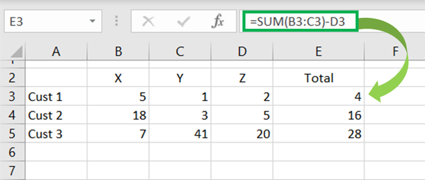
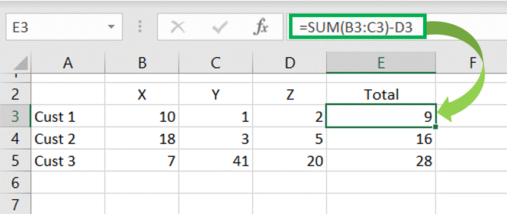

---
 
---
<style>
@import url('https://fonts.googleapis.com/css?family=Scope+One&display=swap');
@import url('https://fonts.googleapis.com/css?family=Scope+One|Unica+One&display=swap&subset=latin-ext');
@import url('https://fonts.googleapis.com/css?family=Open+Sans&display=swap');

h1,h2 {font-family: 'Unica One', cursive;
      font-size: 25px;}
p2 {font-family: 'Unica One', cursive;
      font-size: 25px;}       
p {font-family: 'Open Sans', sans-serif;
      font-size: 15px;}      
</style>
```{r setup, include=FALSE}
knitr::opts_chunk$set(echo = TRUE)
```
&nbsp;    

# Reactivity {.tabset .tabset-fade}  

## Intro to Reactivity  
&nbsp;  

<p2>Understanding Reactivity</p2>
&nbsp;  

<p>**Reactivity** is one of the concepts which allows a Shiny app to be interactive. It is essentially a style of programming which provides a way for a program to compute outputs from a given set of user inputs. Because a Shiny app is able to use reactivity, two-way communication between the end-user and underlying data is possible. 
<br><br>
Use cases for reactivity in Shiny include:  
<ul>
  <li>Performing different types of regressions based on which model type a user chooses</li>
  <li>Manipulating data</li>
  <li>Graphs which update based on chosen data</li>
</ul> 
<br>
</p>

<style>
div.blue {background-color:#0f0f4b; border-radius:5px; padding:20px;}
</style>

<div class="blue">
<font color="white">
<center><p><u>Time Out</u></p></center>
<center><p>Let's bring it back to a world famous reactive programming interface we've all used before...**Excel**! You are essentially writing logical code (formulas) to define relationships between changing inputs (i.e., cells) over time.</p></center> 

<div class = "row">
<div class = "col-md-6">

<center>'Total' in column E is an Output defined by inputs X, Y and Z as shown in the formula bar.</center>
</div>
<div class = "col-md-6">

<center>As inputs change, outputs are updated (i.e., as input X is updated from 5 to 10, the total is recomputed).</center>
</div>
</div>
</font>
</div>
<br>

<p2>Reactive Components</p2>
&nbsp;  

<p>
You have already come across the 2 of the 3 major reactive components of a Shiny app; Inputs and Outputs. Reactive expressions are used in the server script and defines the relationship between inputs and outputs. You've already created a static version of this when using widgets in the previous section.
<br><br>
**Reactive Inputs & Outputs**
<br>
A reactive **input** is an input that the end-user provides to R through the user-interface (via buttons, data uploads, etc.). A reactive **output** is the output provided in the interface which is created based on the reactive inputs provided by the end-user, such as a graph or table. To understand the difference between a static input and a reactive input or between a static output and and a reactive output, consider the following example. 
<br><br>
In the graph below, we use a car dataset that comes built into R (simply call on mpg). The input variables X and Y are static in the sense that you cannot choose a specific variable to graph in its the current format. Instead you can only look at one cross-tab of the variables you have in the dataset. 
```{r, fig.align="center", echo=FALSE}
library(ggplot2)
ggplot(mpg, aes(x = displ, y = hwy, color = class)) +
  geom_point() + xlab("Engine Displacement") + ylab("Hwy Miles per Gallon")
```
<br>
Now let's take the same dataset and **make it reactive**. We want the graph to react based on the choice of X and Y variable, thereby allowing us to analyse the relationship between more than 1 pair of variables. Go ahead and change the choice of X and Y variables!

<center>
<iframe src="https://g4most.shinyapps.io/reactgraph/" width="100%" height="500px" frameBorder="0" class="giphy-embed" allowFullScreen></iframe>
</center>

**Reactive Expressions**
<br>
As you play around, notice how the graph reacts - both axis labels change and the plot itself changes. This is possible due to reactivity (i.e., by providing the input variables, the output graph can be created). **Reactive expressions** define how reactive inputs compute reactive outputs. To see what is happening under the hood, let's start with the following code:

```{r eval=FALSE, include=TRUE}
library(shiny)
library(ggplot2)
library(datasets)
data(mpg) 

ui <- fluidPage(
    titlePanel("Reactive Graph"),
    sidebarLayout(
        sidebarPanel(
            selectInput("x", "Variable X:", choice=colnames(mpg), selected = "displ" ),
            selectInput("y", "Variable Y:", choice=colnames(mpg), selected = "hwy" )) ,   
        mainPanel(
            plotOutput("scatterplot"))
    ))

server <- function(input, output) {
    output$scatterplot <- renderPlot({
        ggplot(mpg, 
               aes_string(x = paste0("`", input$x, "`"), 
                          y = paste0("`", input$y, "`"), color = 'class')) +
               geom_point() + 
               xlab(input$x) + 
               ylab(input$y)
    })}

shinyApp(ui = ui, server = server)
```
<br>
The two `selectInput()` widgets in the UI allow a user to choose the reactive input data (variables selected from the mpg dataset), whilst  `plotOutput("scatterplot")` is the command which displays the reactive output. In the server script, `renderPlot` is the reactive expression which takes the reactive inputs `input$x` and `input$y` from the `selectInput()` in UI and displays a an updated graph.
<br><br>
Compared to the previous static example, Shiny is able to update the inputs, graph, and axes automatically. When a new input is chose, R re-executes and creates a new plot. Inputs can also create more than one reactive output at a time. For example, you can code a file upload which then produces a table, graph and more. 
<br><br>
A few things to note before heading to the next section: 
<ul>
  <li>Reactive values (i.e., `input$x` and `input$y` can only be used within a reactive context/expression.
```{r eval=FALSE, include=TRUE}
#Example of using a reactive input (input$num)without a reactive context:
server <- function(input, output){
  x <- input$num + 1
}
#Correct way to use the same reactive input in a reactive expression:
server <- function(input, output){
  x <- reactive({ input$num + 1 })  
}
```
  </li>
  <li>Any `render*()` function is a reactive context.</li>
  <li>If you attempt to access a reactive inputs from outside of a reactive context, you will throw up an error.</li>
  <li>You can use `reactive({...})` to create a reactive variable (shown in example above). A reactive variable created in this manner can be accessed like any other function in R (i.e., x can be accessed via `x()`).</li>
</ul> 

In the section 'Dynamic UIs', we'll cover how to update the UI itself (i.e., which input options are displayed). 
<br>
</p>

&nbsp;  

## Compare to Observe

skldfj;ak

## Practice


## Checkpoint 4
&nbsp;   
<center>
<iframe src="https://4mosteurope.sharepoint.com/sites/traininganddevelopment/_layouts/15/Doc.aspx?sourcedoc={df5a4d2b-7802-4b11-b5c5-7c6495870e0a}&amp;action=embedview&amp;wdAr=1.7777777777777777" width="962px" height="565px" frameborder="0">This is an embedded <a target="_blank" href="https://office.com">Microsoft Office</a> presentation, powered by <a target="_blank" href="https://office.com/webapps">Office</a>.</iframe>
</center>


