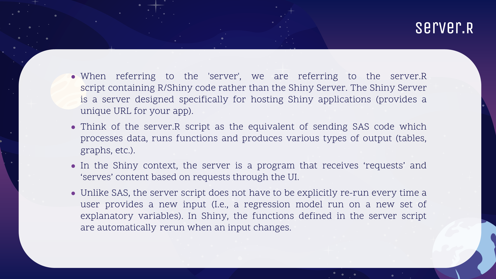

---

---
<style>
@import url('https://fonts.googleapis.com/css?family=Scope+One&display=swap');
@import url('https://fonts.googleapis.com/css?family=Scope+One|Unica+One&display=swap&subset=latin-ext');
@import url('https://fonts.googleapis.com/css?family=Open+Sans&display=swap');

h1,h2 {font-family: 'Unica One', cursive;
  font-size: 25px;}
p2 {font-family: 'Unica One', cursive;
  font-size: 25px;}       
p {font-family: 'Open Sans', sans-serif;
  font-size: 15px;}   
</style>
  ```{r setup, include=FALSE}
knitr::opts_chunk$set(echo = TRUE)
```
&nbsp;   


# Server {.tabset .tabset-fade}  

## Intro to Server  

&nbsp;  
<p>Equally as important as the UI is the Server component of an R Shiny app. Without the server, a UI is pretty but useless...</p>
&nbsp;  
<center>


</center><br>
<center>

</center><br>
<center>

</center>


&nbsp;    


