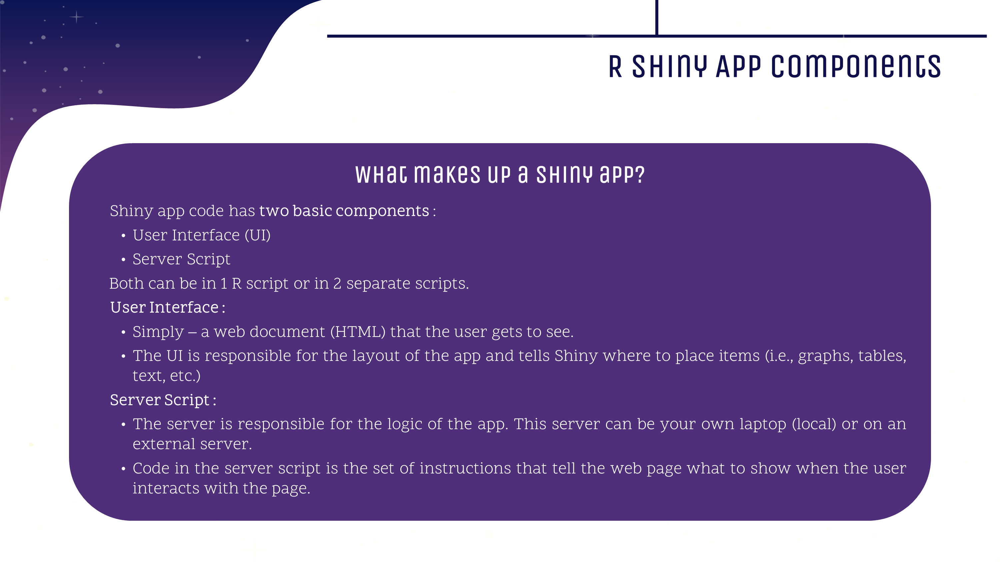
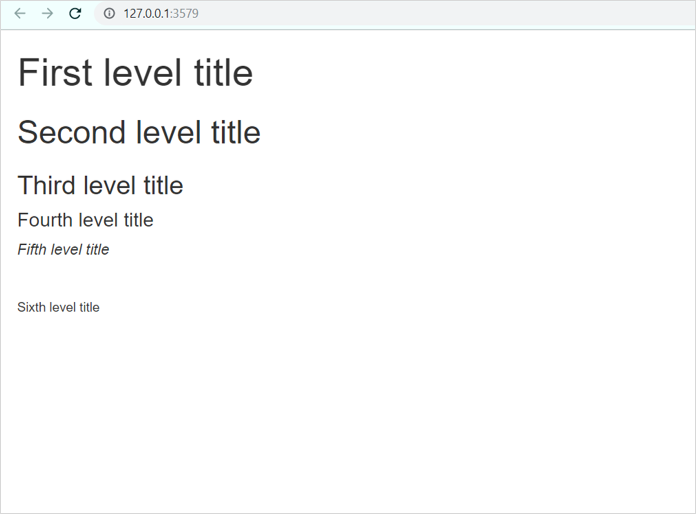
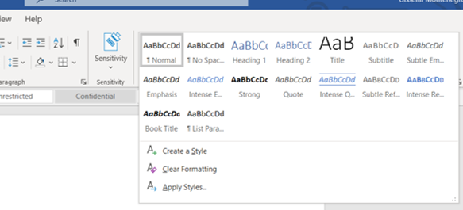
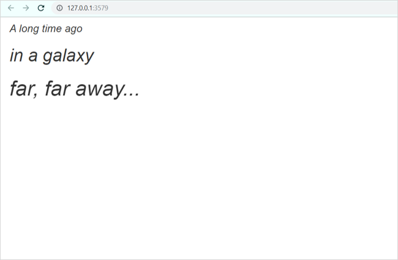
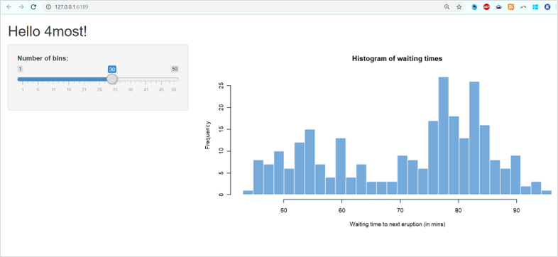
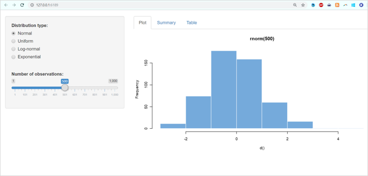
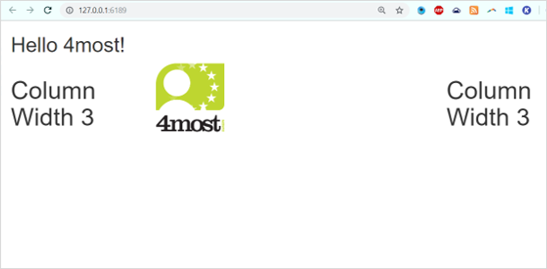
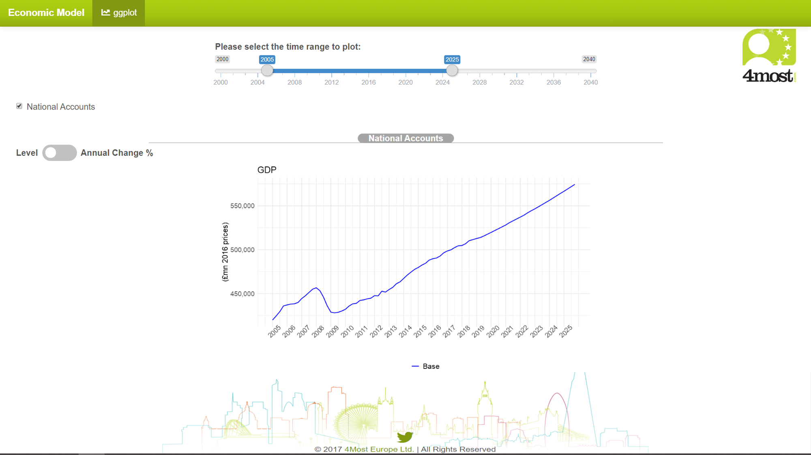
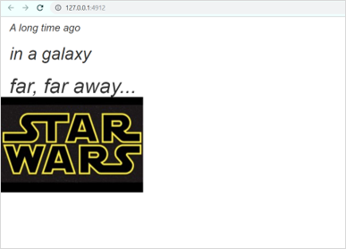

---

---
<style>
@import url('https://fonts.googleapis.com/css?family=Scope+One&display=swap');
@import url('https://fonts.googleapis.com/css?family=Scope+One|Unica+One&display=swap&subset=latin-ext');
@import url('https://fonts.googleapis.com/css?family=Open+Sans&display=swap');

h1,h2 {font-family: 'Unica One', cursive;
  font-size: 25px;}
p2 {font-family: 'Unica One', cursive;
  font-size: 25px;}       
p {font-family: 'Open Sans', sans-serif;
  font-size: 15px;}   
</style>
  ```{r setup, include=FALSE}
knitr::opts_chunk$set(echo = TRUE)
```
&nbsp;    


# UI {.tabset .tabset-fade}  

## UI Intro  
&nbsp;    
Before we go into the nitty gritty of a UI (User Interface), let's go through where it fits into the wider picture. Please note that we will also refer to the UI as the 'front-end' as it's the part of an app a user will get to see. The server is - yes, you guessed it! - the 'backend'.
&nbsp;  

<center>
  
<br><br>
  
</center>
  &nbsp;  

## UI Structure  
&nbsp;  
**Great!** Now that we know why and what a UI is, let's learn how to create one. We're going to start with how to use Shiny functions to lay out the different sections of an interface (i.e., a header, footer, etc.).  
&nbsp;  

<center>
<iframe src="https://4mosteurope.sharepoint.com/sites/traininganddevelopment/_layouts/15/Doc.aspx?sourcedoc={2d107d5a-b149-495d-bbc9-56f4abc225c4}&amp;action=embedview&amp;wdAr=1.7777777777777777" width="962px" height="565px" frameborder="0">This is an embedded <a target="_blank" href="https://office.com">Microsoft Office</a> presentation, powered by <a target="_blank" href="https://office.com/webapps">Office</a>.</iframe>
</center>
&nbsp;  

<p2>Delving Further Into fluidPage(...)</p2>
&nbsp;  

<p>
In the slides above we covered the various options for how to layout the UI for your app. Today we will focus on using **fluidpage()** to create the layout of your app as it's the most common layout function today for general Shiny apps and you will likely come across it quite often in the example code you see across the internet. This is not to say that you shouldn't learn the other two options! **Flexdahsboard()** is commonly utilised in dashboard applications (i.e., your monthly MI) and the use of CSS Grid is very likely to grow in the future.</p>  

<p>As mentioned previously, **fluidPage()** is a layout function which defines defines the UI for your app. It will take on arguments as needed (i.e., content) that you may want your layout to contain.</p>

```{r eval=FALSE}
#Pseudo code example of the fluidPage() layout function taking on 3 arguments
ui <- fluidPage(argument1, argument2, argument3)

#You can use an 'empty' server to test the layout of your app.
server <- function(input, output){ #empty server function
  }
```
<p>So I know what you're wondering, what kind of arguments can I include and what do they do??
  You can include the following argument types:
  <ul>
  <li><a href="#targetname">Text Elements</a></li>
  <li><a href="#targetlayout">Layout Functions (i.e., create a sidebar or header)</a></li>
  <li><a href="#targetstatic">Static Elements (i.e., logo, graphics, etc.)</a></li>
  <li>HTML/CSS</li>
  <li>Dynamic Inputs (i.e., buttons, sliders, drop-down lists, etc.)</li>
  </ul>
In this section, we are going to focus on the first 3 elements as they have more of a direct impact on the layout of your app. 

<br>  

<p2><a name="targetname">Text Elements</a></p2>

<p>Text elements refer to any titles, paragraphs, and headers that you may have throughout your app. We're going to start with basic text functions and later replace them with the use of HTML/CSS. This will be especially useful if you decide to include documentation as part of your application.</p>

<p>The following table contains key basic Shiny text functions which you would place within the fluidpage(...) function. You can also embed certain functions within others (i.e., italicized text within a first level header).</p>

  | Shiny Text Functions | Description |
  |:---------:|:---------:|
  | p("...") | A paragraph of text. |
  | h1("...") | A first level header |
  | h2("...") | A second level header |
  | h3("...") | A third level header |
  | h4("...") | A fourth level header |
  | br( ) | A line break (blank line) |
  | strong("...") | Bold text |
  | em("...") | Italicized text|

<p>The following code uses the pseudo code we created above and includes text elements as fluidPage( ) arguments.</p>
```{r eval=FALSE, include=TRUE}
library(shiny)

ui <- fluidPage(
      h1("First level title"), #argument 1
      h2("Second level title"), #argument 2
      h3("Third level title"),
      h4("Fourth level title"),
      h5(em("Fifth level title")), #fifth header level with italicization
      br(), #line break
      h6("Sixth level title")    )

server <- function(input, output) { }

# Run the application 
shinyApp(ui = ui, server = server)
```

<p>Running the code above produces the following app.</p>

<center>
<div style="width:50%; height:30%">

</div>
</center>

<br>
<p>As you can see, it's fairly straightforward to add text in your interface. Each text function applies the same format assigned to that particular function (i.e., h1 will always produce bold, large text). This is very similar to applying the same formatting to headers in documentation which you find in Microsoft Word.</p>
<center>
<div style="width:50%; height:30%">

</div>
</center>
<br>
<p>To create your own text styles, you will learn to use HTML tags later in the training. Don't worry, we will get there!</p>
<br>
<style>
div.blue {background-color:#0f0f4b; border-radius:5px; padding:20px;}
</style>

<div class="blue">
<font color="white">
 <p style="font-size:15px; display:inline;"> Let's have a little fun and practice - Using the commands you've just learned, see if you can create the following app:</p></img>

<div class = "row">
<div class = "col-md-6">


</div>
<div class = "col-md-6">
<div id="testing2" style="display:none;">
```{r eval=FALSE, include=TRUE}
library(shiny)

ui <- fluidPage(
  h4(em("A long time ago")), 
  h2(em("in a galaxy")), 
  h1(em("far, far away..."))  )

server <- function(input, output) { }

# Run the application 
shinyApp(ui = ui, server = server)
```
</div>

<button onclick="myFunction()"><p style="color:#696969">Click me if you've tried!</p></button>

<p id="demo2"></p>

<script>
function myFunction() {
  var x = document.getElementById("testing2").innerHTML;
  document.getElementById("demo2").innerHTML = x;
}
</script>

</div>
</div>
</font>
</div>
<br>

&nbsp;  

<p2><a name="targetlayout">Shiny UI Layout Functions</a></p2>

<p>The following table contains  the various layout options that you can use. It is not an exhaustive list but does contain the functions you are most likely to need or come across. Non-fluidPage layout options are listed toward the bottom. </p>
  
  |  Shiny UI Functions  |      Description      |
  |:---------------------|:----------------------|
  | [fluidPage()](https://shiny.rstudio.com/reference/shiny/0.14/column.html)| All fluidPage layouts must start with this function |
  | fluidRow() | Creates a row to separate content vertically       |
  | [column()](https://shiny.rstudio.com/reference/shiny/latest/column.html)   | Passed to fluidRow to separate content horizontally |
  | [titlePanel()](https://shiny.rstudio.com/reference/shiny/0.14/titlePanel.html)   | Creates a panel containing the application title.  |
  | [headerPanel()](https://shiny.rstudio.com/reference/shiny/0.11/headerPanel.html)  | Creates a header panel        |
  | [sidebarLayout()](https://shiny.rstudio.com/reference/shiny/0.14/sidebarLayout.html)| Creates sidebar to add content|
  | [sidebarPanel()](https://shiny.rstudio.com/reference/shiny/0.14/sidebarPanel.html) | The side Panel argument passed to sidebarLayout()  |
  | [mainPanel()](https://shiny.rstudio.com/reference/shiny/0.14/mainPanel.html)    | The main Panel argument passed to sidebarLayout()  |
  | [tabsetPanel()](https://shiny.rstudio.com/reference/shiny/0.14/tabsetPanel.html)  | Creates tabs on which you can add different content|
  | [tabPanel()](https://shiny.rstudio.com/reference/shiny/0.14/tabPanel.html)     | A tab passed to tabsetPanel() |
  | [conditionalPanel()](https://shiny.rstudio.com/reference/shiny/0.11/conditionalPanel.html)| Creates a panel which exists when a condition is met |
  | [navbarPage()](https://shiny.rstudio.com/reference/shiny/1.0.5/navbarPage.html)   | Creates a page with a navigation bar at the top     |
  | [navlistPanel()](https://shiny.rstudio.com/reference/shiny/latest/navlistPanel.html) | Similar to tabPanel except that navigation is on the left instead of the top|
  | [wellPanel()](https://shiny.rstudio.com/reference/shiny/0.11/wellPanel.html)| Creates a panel with a slightly inset border and grey background |
  | [inputPanel()](https://shiny.rstudio.com/reference/shiny/0.11/inputPanel.html) | A flowLayout with a grey border and light grey background|
  | [absolutePanel()](https://shiny.rstudio.com/reference/shiny/0.12.1/absolutePanel.html) | Creates a panel whose contents are absolutely positioned |
  | [splitLayout()](https://shiny.rstudio.com/reference/shiny/0.14/splitLayout.html)  | Lays out elements horizontally, dividing the available horizontal space into equal parts (by default)|
  | [verticalLayout()](https://shiny.rstudio.com/reference/shiny/0.14/verticalLayout.html) | Create a container that includes one or more rows of content (each element passed to the container will appear on it's own line in the UI)|
| [flowLayout()](https://shiny.rstudio.com/reference/shiny/0.14/flowLayout.html) | Lays out elements in a left-to-right, top-to-bottom arrangement|


<p>
You can embed certain functions inside of others, such as tabPanel( ) inside of tabsetPanel( ) or the use of sidebarPanel( ) inside of sidebarLayout( ). And yes, you could even embed sidebarLayout( ) inside of tabsetPanel( )! Just remember to separate each of these functions with a comma.
</p>

<p>Today, we will build two fairly basic, but common layouts - the Sidebar Layout and an application using tabs.We will also quickly cover a simple example using fluidRow. Let's start with the Sidebar Layout:</p>
<center>

</center>
<br>
<p>The code below produces the app. I've included some code that you will not understand until we go through control widgets but is there so you can view the layout.</p>

```{r eval=FALSE, include=TRUE}
library(shiny)
library(datasets)
data("faithful") #in build dataset

#Sidebar Layout 
ui <- fluidPage( #All layout functions are held here
  titlePanel("Hello 4most!"),
  sidebarLayout(
    sidebarPanel( #sidebarPanel feed into the sidebarLayout
      # Input: Slider for the number of bins - Not expected to know this yet
      sliderInput(inputId = "bins",
                  label = "Number of bins:",
                  min = 1, max = 50, value = 30) ),
    mainPanel( #mainPanel to the right of the sidebarPanel 
      #displays output - Not expected to know this yet
      plotOutput(outputID="distplot") )
  )
)

server <- function(input, output) {
  # Histogram of the Old Faithful Geyser Data - Not expected to know this yet
    output$distPlot <- renderPlot({
      x    <- faithful$waiting
      bins <- seq(min(x), max(x), length.out = input$bins + 1)
      hist(x, breaks = bins, col = "#75AADB", border = "white",
           xlab = "Waiting time to next eruption (in mins)",
           main = "Histogram of waiting times")})
}

# Run the application 
shinyApp(ui = ui, server = server)
```
<br>
<p>Now let's create an application with a sidebar and content on different tabs!</p>

<center>

</center>
<br>
<p>As above, there are control widgets that we've not covered yet and are included for illustration purposes</p>
```{r eval=FALSE, include=TRUE}
library(shiny)

ui <- fluidPage(
  br(), #included for some vertical space at the top
  sidebarLayout( #holds sidebarPanel and mainPanel
    sidebarPanel(
        radioButtons("dist", "Distribution type:",
                     c("Normal" = "norm", "Uniform" = "unif",
                       "Log-normal" = "lnorm", "Exponential" = "exp")),
        br(),
        sliderInput("n", "Number of observations:",
                    value = 500, min = 1, max = 1000)
    ),
    mainPanel( #Place the tabs within the main panel
      tabsetPanel(type = "tabs",
                  tabPanel("Plot", plotOutput("plot")), #First tab and content
                  tabPanel("Summary", verbatimTextOutput("summary")), #Second tab
                  tabPanel("Table", tableOutput("table")) # Third tab and content
      ))
  ))

server <- function(input, output) {
  # Reactive expression to generate the requested distribution ----
  d <- reactive({
        dist <- switch(input$dist,
                       norm = rnorm, unif = runif,
                       lnorm = rlnorm, exp = rexp, rnorm)
        dist(input$n) })
  
  # Generate a plot of the data - Displayed on first tab
  output$plot <- renderPlot({
        dist <- input$dist
        n <- input$n
        hist(d(), main = paste("r", dist, "(", n, ")", sep = ""),
                  col = "#75AADB", border = "white") })
  
  # Generate a summary of the data - Displayed on second tab
  output$summary <- renderPrint({ summary(d()) })
  
  # Generate an HTML table view of the data - Displayed on third tab
  output$table <- renderTable({  d() })
}

shinyApp(ui, server)
```
<br>
<p>The next example covers the use of fluidRow( ). fluidRow can include further layout functions (such as column as illustrated below) or specific content that you want to lay within the same row. Content outside of fluidRow( ) will fall in a different vertical space. For example, the titlePanel( ) containing "Hello 4most!" is outside of fluidRow( ) and therefore the content is not on the same row as the text and 4most logo:</p>
<center>

</center>
<br>
```{r eval=FALSE, include=TRUE}
library(shiny)

#Sidebar Layout
ui <- fluidPage(
  titlePanel("Hello 4most!"),
  fluidRow( #Insert 3 columns adding up to the 12 unit width used in fluidPage()
    column(3, h1("Column Width 3")), #This column (width=3)can remain empty for empty space
    column(6, img(src="4Most.png", height = 100, width = 100, align ="left")),
    column(3, h1("Column Width 3")) #Third column with width 3
  )
)

server <- function(input, output) {
  #Empty for this example }  
shinyApp(ui = ui, server = server)
```
&nbsp; 

<p>
In the following section, we'll look at a simplified version of the 4most Economic Model tool and how to recreate the layout. As a final step, we'll also cover conditionalPanels. 
</p>
&nbsp;  

<p2>fluidPage(...) example using a 4most app</p2>
&nbsp;  
<p>Below is a screenshot of a simplified version of the 4most Economic Model tool. We Let's break down it's components and see how we can build the layout with the knowledge we've gained so far.</p>
#waiting to hear back from Fraser 
<center>

</center>

<p> </p>

```{r eval=FALSE, include=TRUE}
library(shiny)

ui <- fluidPage(
      titlePanel(title="4Most", windowTitle="4Most - Economic Model")),
  h2(em("in a galaxy")), 
  h1(em("far, far away..."))  )

server <- function(input, output) { }

# Run the application 
shinyApp(ui = ui, server = server)
```
&nbsp;    

<p2><a name="targetstatic">Static Elements</a></p2>

<p>Remember that www/ folder we initially created when setting up your working directory? Well, now is when it comes to use! </p>
```{r eval=FALSE, include=TRUE}
Folder Structure
| shinyApp/
  | ui.R
  | server.R
| www/ #Folder in which you place all images and logos you want to embed.
  | image.png
```

<p>Once you've placed the image in the www/ folder, you will need to call it from within the layout function/area you want shiny to display it from. As an example, we're going to add an image to the example we previously practiced with (adding text elements): </p>

<center>

</center>
<p>To insert the Star Wars image you see above, you will place the image in the www/ folder and decide where in the app you want to see it. In the example above, I've created a row below the text and inserted the image there as shown in the code:</p>

```{r eval=FALSE, include=TRUE}
library(shiny)

ui <- fluidPage(
  h4(em("A long time ago")), 
  h2(em("in a galaxy")), 
  h1(em("far, far away...")),
  fluidRow(img(src="starwars3.jpg")))

server <- function(input, output) { }

# Run the application 
shinyApp(ui = ui, server = server)
```

<p>This is **not your only option**. You can also insert images using HTML. We will go further into HTML when we're further along in the training but the following example code demonstrates how we could utilise HTML instead to produce the same app. I've also added a command to center the image in this example:</p>

```{r eval=FALSE, include=TRUE}
library(shiny)

ui <- fluidPage(
  h4(em("A long time ago")), 
  h2(em("in a galaxy")), 
  h1(em("far, far away...")),
  HTML('<center></center>'))

server <- function(input, output) { }

# Run the application 
shinyApp(ui = ui, server = server)
```
<br>
<style>
div.blue {background-color:#0f0f4b; border-radius:5px; padding:5px;}
</style>

<div class="blue">
<font color="white">
<center> <p style="font-size:15px; display:inline;"> Time to think about your app!</p></img></center><br>
<center><p>Are there any images or logos you would like to include? In which section of your app are planning to place them in?</p></center>

&nbsp;    

## UI Practice    
&nbsp;    
Practice your knowledge! For solutions today - ask Gissella or Nir :)  
&nbsp;    

<iframe src="https://4mosteurope.sharepoint.com/sites/traininganddevelopment/_layouts/15/Doc.aspx?sourcedoc={0773d174-dea0-47bc-8a5b-33fcac729730}&amp;action=embedview&amp;wdAr=1.7777777777777776" width="962px" height="565px" frameborder="0">This is an embedded <a target="_blank" href="https://office.com">Microsoft Office</a> presentation, powered by <a target="_blank" href="https://office.com/webapps">Office</a>.</iframe>  
&nbsp;  


## Design Considerations  

&nbsp;    
<iframe src="https://4mosteurope.sharepoint.com/sites/traininganddevelopment/_layouts/15/Doc.aspx?sourcedoc={edb6264a-3bf7-4e09-9c6a-768e6cfb0a1c}&amp;action=embedview&amp;wdAr=1.7777777777777776" width="962px" height="565px" frameborder="0">This is an embedded <a target="_blank" href="https://office.com">Microsoft Office</a> presentation, powered by <a target="_blank" href="https://office.com/webapps">Office</a>.</iframe>  
&nbsp;  

## Checkpoint 2
&nbsp;    
Time for the next step in creating our app today:  
&nbsp; 

<iframe src="https://4mosteurope.sharepoint.com/sites/traininganddevelopment/_layouts/15/Doc.aspx?sourcedoc={d0742f79-f991-4f49-969e-18c4ed484796}&amp;action=embedview&amp;wdAr=1.7777777777777776" width="962px" height="565px" frameborder="0">This is an embedded <a target="_blank" href="https://office.com">Microsoft Office</a> presentation, powered by <a target="_blank" href="https://office.com/webapps">Office</a>.</iframe>
&nbsp;  


