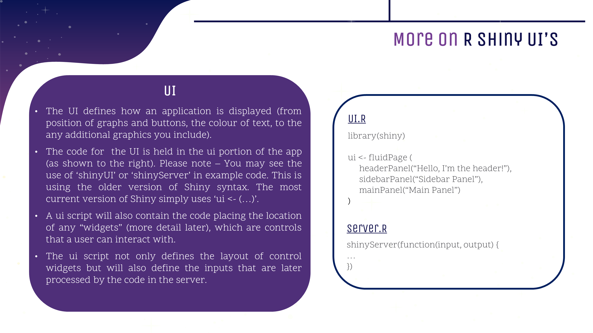

---

---
<style>
@import url('https://fonts.googleapis.com/css?family=Scope+One&display=swap');
@import url('https://fonts.googleapis.com/css?family=Scope+One|Unica+One&display=swap&subset=latin-ext');
@import url('https://fonts.googleapis.com/css?family=Open+Sans&display=swap');

h1,h2 {font-family: 'Unica One', cursive;
  font-size: 25px;}
p2 {font-family: 'Unica One', cursive;
  font-size: 25px;}       
p {font-family: 'Open Sans', sans-serif;
  font-size: 15px;}     
</style>
  ```{r setup, include=FALSE}
knitr::opts_chunk$set(echo = TRUE)
```
&nbsp;    


# UI {.tabset .tabset-fade}  

## UI Intro  
&nbsp;    
Before we go into the nitty gritty of a UI (User Interface), let's go through where it fits into the wider picture. Please note that we will also refer to the UI as the 'front-end' as it's the part of an app a user will get to see. The server is - yes, you guessed it! - the 'backend'.
&nbsp;  

<center>
  
<br><br>
  
</center>
  &nbsp;  

## UI Structure  
&nbsp;  
**Great!** Now that we know why and what a UI is, let's learn how to create one.  
&nbsp;  

<center>
<iframe src="https://4mosteurope.sharepoint.com/sites/traininganddevelopment/_layouts/15/Doc.aspx?sourcedoc={2d107d5a-b149-495d-bbc9-56f4abc225c4}&amp;action=embedview&amp;wdAr=1.7777777777777777" width="962px" height="565px" frameborder="0">This is an embedded <a target="_blank" href="https://office.com">Microsoft Office</a> presentation, powered by <a target="_blank" href="https://office.com/webapps">Office</a>.</iframe>
</center>
&nbsp;  

<p2>Delving Further Into fluidPage(...)</p2>
&nbsp;  

<p>
In the slides above we covered the various options for how to layout the UI for your app. Today we will focus on using **fluidpage()** to create the layout of your app as it's the most common layout function today for general Shiny apps and you will likely come across it quite often in the example code you see across the internet. This is not to say that you shouldn't learn the other two options! **Flexdahsboard()** is commonly utilised in dashboard applications (i.e., your monthly MI) and the use of CSS Grid is very likely to grow in the future.</p>  

<p>As mentioned previously, **fluidPage()** is a layout function which defines defines the UI for your app. It will take on arguments as needed (i.e., content) that you may want your layout to contain.</p>

```{r eval=FALSE}
#Pseudo code examplf of the fluidPage() layout function taking on 3 arguments
ui <- fluidPage(argument1, argument2, argument3)

#You can use an 'empty' server to test the layout of your app.
server <- function(input, output){ #empty server function
  }
```
<p>So I know what you're wondering, what kind of arguments can I include and what do they do??
  You can include the following argument types:
  <ul>
  <li>Text Elements</li>
  <li></li>
  <li>Static Elements</li>
  <li>HTML</li>
  <li>Dynamic Inputs</li>
  </ul>
  In this section, we are going to focus on the first 3 elements as they have more of a direct impact on the layout of your app. 

<p>The following table contains  the various layout options that you can use. It is not an exhaustive list but does contain the functions you are most likely to need or come across. Non-fluidPage layout options are listed toward the bottom. </p>
  
  |  Shiny UI Functions  |      Description      |
  |:---------------------|:----------------------|
  | [fluidPage()](https://shiny.rstudio.com/reference/shiny/0.14/column.html)| All fluidPage layouts must start with this function |
  | fluidRow() | Creates a row to separate content vertically       |
  | [column()](https://shiny.rstudio.com/reference/shiny/latest/column.html)   | Passed to fluidRow to separate content horizontally |
  | [titlePanel()](https://shiny.rstudio.com/reference/shiny/0.14/titlePanel.html)   | Creates a panel containing the application title.  |
  | [headerPanel()](https://shiny.rstudio.com/reference/shiny/0.11/headerPanel.html)  | Creates a header panel        |
  | [sidebarLayout()](https://shiny.rstudio.com/reference/shiny/0.14/sidebarLayout.html)| Creates sidebar to add content|
  | [sidebarPanel()](https://shiny.rstudio.com/reference/shiny/0.14/sidebarPanel.html) | The side Panel argument passed to sidebarLayout()  |
  | [mainPanel()](https://shiny.rstudio.com/reference/shiny/0.14/mainPanel.html)    | The main Panel argument passed to sidebarLayout()  |
  | [tabsetPanel()](https://shiny.rstudio.com/reference/shiny/0.14/tabsetPanel.html)  | Creates tabs on which you can add different content|
  | [tabPanel()](https://shiny.rstudio.com/reference/shiny/0.14/tabPanel.html)     | A tab passed to tabsetPanel() |
  | [conditionalPanel()](https://shiny.rstudio.com/reference/shiny/0.11/conditionalPanel.html)| Creates a panel which exists when a condition is met |
  | [navbarPage()](https://shiny.rstudio.com/reference/shiny/1.0.5/navbarPage.html)   | Creates a page with a navigation bar at the top     |
  | [navlistPanel()](https://shiny.rstudio.com/reference/shiny/latest/navlistPanel.html) | Similar to tabPanel except that navigation is on the left instead of the top|
  | [wellPanel()](https://shiny.rstudio.com/reference/shiny/0.11/wellPanel.html)| Creates a panel with a slightly inset border and grey background |
  | [inputPanel()](https://shiny.rstudio.com/reference/shiny/0.11/inputPanel.html) | A flowLayout with a grey border and light grey background|
  | [absolutePanel()](https://shiny.rstudio.com/reference/shiny/0.12.1/absolutePanel.html) | Creates a panel whose contents are absolutely positioned |
  | [splitLayout()](https://shiny.rstudio.com/reference/shiny/0.14/splitLayout.html)  | Lays out elements horizontally, dividing the available horizontal space into equal parts (by default)|
  | [verticalLayout()](https://shiny.rstudio.com/reference/shiny/0.14/verticalLayout.html) | Create a container that includes one or more rows of content (each element passed to the container will appear on it's own line in the UI)|
| [flowLayout()](https://shiny.rstudio.com/reference/shiny/0.14/flowLayout.html) | Lays out elements in a left-to-right, top-to-bottom arrangement|


<p>
You can embed certain functions inside of others, such as tabPanel() inside of tabsetPanel() or the use of mainPanel() and sidebarPanel() inside of sidebarLayout(). And yes, you could even embed sidebarLayout() inside of tabsetPanel()!
</p>

#insert examples from rstudio page
#add links to documentation in table above


&nbsp; 

<p>
In the following section, we'll look at a simplified version of the 4most Economic Model tool and how to recreate the layout. As a final step, we'll also cover conditionalPanels. 
</p>
&nbsp;  

<p2>fluidPage(...) using a 4most app</p2>
&nbsp;  

<center>

</center>

## UI Practice    
&nbsp;    
Practice your knowledge! For solutions today - ask Gissella or Nir :)  
&nbsp;    

<iframe src="https://4mosteurope.sharepoint.com/sites/traininganddevelopment/_layouts/15/Doc.aspx?sourcedoc={0773d174-dea0-47bc-8a5b-33fcac729730}&amp;action=embedview&amp;wdAr=1.7777777777777776" width="962px" height="565px" frameborder="0">This is an embedded <a target="_blank" href="https://office.com">Microsoft Office</a> presentation, powered by <a target="_blank" href="https://office.com/webapps">Office</a>.</iframe>  
&nbsp;  


## Design Considerations  

&nbsp;    
<iframe src="https://4mosteurope.sharepoint.com/sites/traininganddevelopment/_layouts/15/Doc.aspx?sourcedoc={edb6264a-3bf7-4e09-9c6a-768e6cfb0a1c}&amp;action=embedview&amp;wdAr=1.7777777777777776" width="962px" height="565px" frameborder="0">This is an embedded <a target="_blank" href="https://office.com">Microsoft Office</a> presentation, powered by <a target="_blank" href="https://office.com/webapps">Office</a>.</iframe>  
&nbsp;  

## Checkpoint 2
&nbsp;    
Time for the next step in creating our app today:  
&nbsp; 

<iframe src="https://4mosteurope.sharepoint.com/sites/traininganddevelopment/_layouts/15/Doc.aspx?sourcedoc={d0742f79-f991-4f49-969e-18c4ed484796}&amp;action=embedview&amp;wdAr=1.7777777777777776" width="962px" height="565px" frameborder="0">This is an embedded <a target="_blank" href="https://office.com">Microsoft Office</a> presentation, powered by <a target="_blank" href="https://office.com/webapps">Office</a>.</iframe>
&nbsp;  


