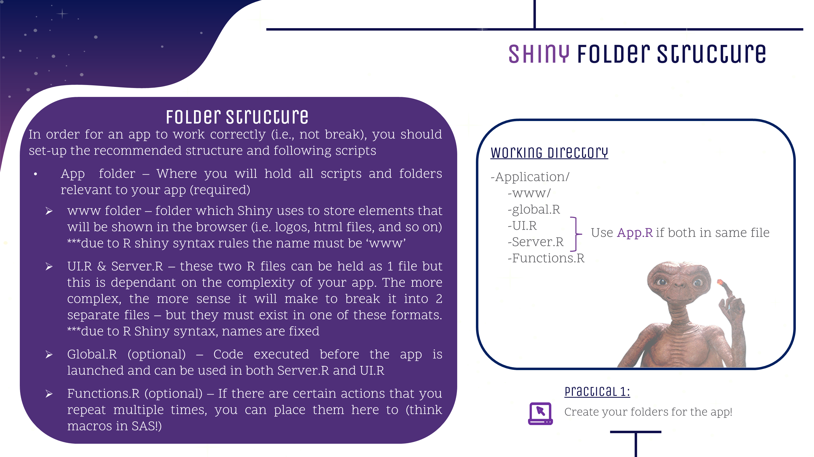

---

---
<style>
@import url('https://fonts.googleapis.com/css?family=Scope+One&display=swap');
@import url('https://fonts.googleapis.com/css?family=Scope+One|Unica+One&display=swap&subset=latin-ext');
@import url('https://fonts.googleapis.com/css?family=Open+Sans&display=swap');

h1,h2 {font-family: 'Unica One', cursive;
      font-size: 25px;}
p {font-family: 'Open Sans', sans-serif;
      font-size: 13px;}      
</style>

```{r setup, include=FALSE}
knitr::opts_chunk$set(echo = TRUE)
```
&nbsp;  

# Why Shiny {.tabset .tabset-fade}  

## Intro  

<center>
<iframe src="https://4mosteurope.sharepoint.com/sites/traininganddevelopment/_layouts/15/Doc.aspx?sourcedoc={1b639700-c918-423d-b168-55eb1df8868d}&amp;action=embedview&amp;wdAr=1.7777777777777776" width="962px" height="565px" frameborder="0">This is an embedded <a target="_blank" href="https://office.com">Microsoft Office</a> presentation, powered by <a target="_blank" href="https://office.com/webapps">Office</a>.</iframe>
</center>

&nbsp;  

## Shiny Site Examples  

&nbsp;    

Below are examples of what can be done in Shiny.  

&nbsp;    
Police and Demand Planning Tool

&nbsp;    

<center>
<iframe width="100%" height="550" src="https://gallery.shinyapps.io/TSupplyDemand/" scrolling= "yes"></iframe>
</center>  

&nbsp;    

A Shiny App to visualize and share a dog's medical history. [Github Code](https://github.com/jennaallen/dog_days/tree/master/pet-records-app)  
&nbsp;  

<center>
<iframe width="100%" height="550" src="https://jennadallen.shinyapps.io/pet-records-app/" scrolling= "yes"></iframe>  
</center>    

&nbsp;    

Real estate analytics, prediction modeling and forecasting for over 20,000 U.S. real estate markets. [Github Code](https://github.com/j2scode/shinyHome) 
&nbsp;    

<center>
<iframe width="100%" height="550" src="https://jjames.shinyapps.io/shinyHome/" scrolling= "yes"></iframe>  
</center>  

&nbsp;    

## Starting to Build     

### Let's get started!  
 <p style="font-size:16px; display:inline;">Task 1: Create the folder structure in your working directory as shown below. </p></img>  


&nbsp;
<center>
<div style="width:95%; height:85%">

</div>
</center>
&nbsp;  

 <p style="font-size:16px; display:inline;">Task 2: Create Shiny script and load Shiny library. </p></img> 
&nbsp;  

<p style="font-size:14px;">To create your first Shiny app you have **two** options:  

1) Open a new script and insert the following:</p>
```{r eval=FALSE}
library(shiny)

ui <- fluidPage()

server <- function(input, output) {}

shinyApp(ui = ui, server = server)
```

&nbsp;  
<p style="font-size:14px;"> 2) While in your working directory (as created above), go to *File--> New File--> Shiny Web App*.This option will create a Shiny App in two scripts rather than one.</p>  
<center>
<div style="width:50%; height:50%">


&nbsp;  
 <p style="font-size:16px; display:inline;">Task 3: Your app will be empty or will contain default code. Test Shiny works by running your app as shown below. </p></img> 

&nbsp;  
<center>
<div style="width:95%; height:85%">

</div>
</center>
&nbsp;  

## Checkpoint 1
<center>
<iframe src="https://giphy.com/embed/UVG0BN8TOMKkPOJS6e" width="75" height="75" frameBorder="0" class="giphy-embed" allowFullScreen></iframe>
<font size="14">App Time</font>
<iframe src="https://giphy.com/embed/UVG0BN8TOMKkPOJS6e" width="75" height="75" frameBorder="0" class="giphy-embed" allowFullScreen></iframe>
</center>

&nbsp;  

We will gradually build an app in steps today. Follow the brief below for your first step. 
<center>
<iframe src="https://4mosteurope.sharepoint.com/sites/traininganddevelopment/_layouts/15/Doc.aspx?sourcedoc={e3d5ed33-23c3-49c4-8882-ea750e468c25}&amp;action=embedview&amp;wdAr=1.7777777777777776" width="962px" height="565px" frameborder="0">This is an embedded <a target="_blank" href="https://office.com">Microsoft Office</a> presentation, powered by <a target="_blank" href="https://office.com/webapps">Office</a>.</iframe>
</center>


