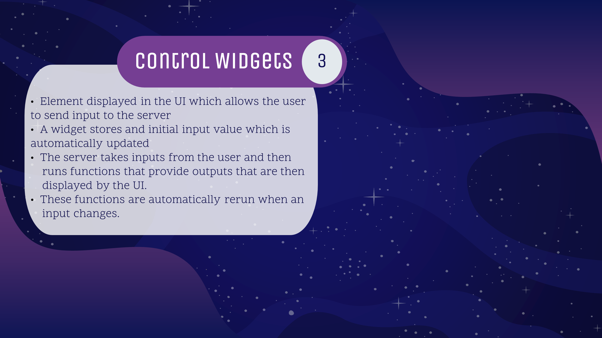
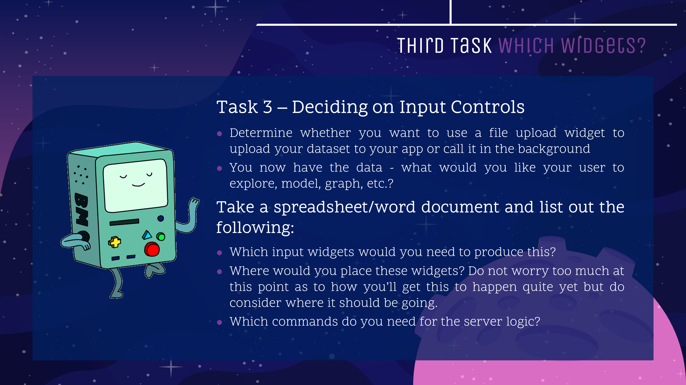

---

---
<style>
@import url('https://fonts.googleapis.com/css?family=Scope+One&display=swap');
@import url('https://fonts.googleapis.com/css?family=Scope+One|Unica+One&display=swap&subset=latin-ext');
@import url('https://fonts.googleapis.com/css?family=Open+Sans&display=swap');

h1,h2 {font-family: 'Unica One', cursive;
  font-size: 25px;}
p2 {font-family: 'Unica One', cursive;
  font-size: 25px;}       
p {font-family: 'Open Sans', sans-serif;
  font-size: 15px;}   
</style>
  ```{r setup, include=FALSE}
knitr::opts_chunk$set(echo = TRUE)
```
&nbsp;  


# Inputs & Outputs {.tabset .tabset-fade}  

## Intro  
&nbsp;  
Ok, we know where to place things and where to tell them what to do - but what can we put in an app??
&nbsp; 

<center>

&nbsp; 
<br>

<p2>What are Widgets?</p2>
<br>
<p>A widget is a web element that you can interact with. If you’ve used the internet, you’ve used a widget!<.p>

<p>Widgets will allow you or your users to send requests to the Shiny app. A widget will collect the request whether it’s a value, string, or chosen from a list. When the widget is changed, the output will also change. </p>

<p>The widgets shown here are the 13 pre-built widgets that come with Shiny:</p>
<br>
<center>

</center>
<br>

## Widgets 101
&nbsp;  

<p>Delve in deeper (coding part) - also mention widget gallery online and in console</p>
#insert slide with widget arguments(inputID, label)

<br>

## Examples  

&nbsp;  
<p2>Widget examples</p2>
<p></p>

<center>
<iframe width="100%" height="1000px" src="https://g4most.shinyapps.io/Example_file/" scrolling= "yes"></iframe>  
</center>  


<br> <br>

## Practice  

&nbsp;  
Practice problems  

<center>
<iframe width="100%" height="550" src="https://g4most.shinyapps.io/testing1/" scrolling= "yes"></iframe> </center>  

## Checkpoint 3

&nbsp;  
<center>

</center>
&nbsp;  

## Advanced Widgets

&nbsp;  
More resource than to actually cover


  