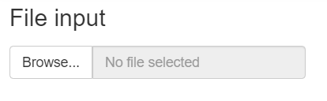
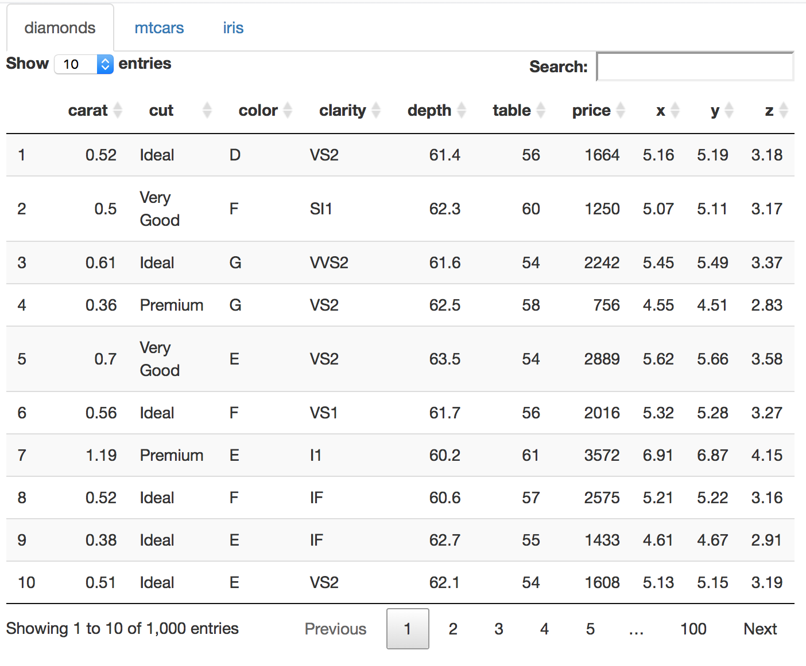
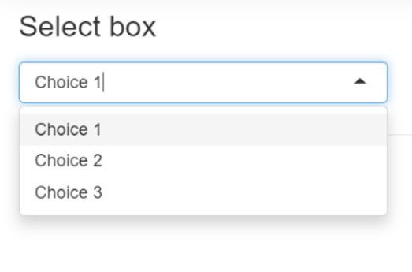
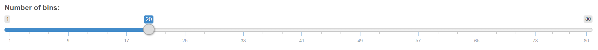
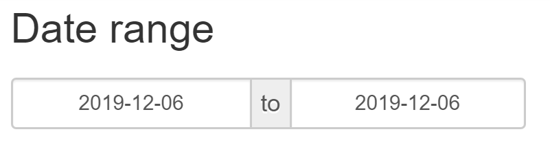
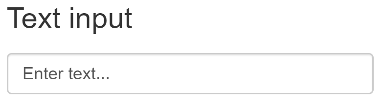
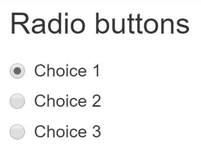

---

---
<style>
@import url('https://fonts.googleapis.com/css?family=Scope+One&display=swap');
@import url('https://fonts.googleapis.com/css?family=Scope+One|Unica+One&display=swap&subset=latin-ext');
@import url('https://fonts.googleapis.com/css?family=Open+Sans&display=swap');

h1,h2 {font-family: 'Unica One', cursive;
  font-size: 25px;}
p2 {font-family: 'Unica One', cursive;
  font-size: 25px;}       
p {font-family: 'Open Sans', sans-serif;
  font-size: 15px;}   
</style>
  ```{r setup, include=FALSE}
knitr::opts_chunk$set(echo = TRUE)
```
&nbsp;  


# Inputs & Outputs {.tabset .tabset-fade}  

## Intro  

&nbsp;  
Ok, we know where to place things and where to tell them what to do - but what can we put in an app??
&nbsp; 

<center>
<iframe src="https://4mosteurope.sharepoint.com/sites/traininganddevelopment/_layouts/15/Doc.aspx?sourcedoc={57513390-37f3-4db5-9506-ce8fbb21048e}&amp;action=embedview&amp;wdAr=1.7777777777777776" width="962px" height="565px" frameborder="0">This is an embedded <a target="_blank" href="https://office.com">Microsoft Office</a> presentation, powered by <a target="_blank" href="https://office.com/webapps">Office</a>.</iframe>
</center>

&nbsp; 

GISSELLA NOTE: IT MAY MAKE MORE SENSE TO PULL THIS CONTENT OUT OF SLIDES.  
&nbsp;   

## Widgets 101

&nbsp;  
Delve in deeper (coding part) - also mention widget gallery online and in console

## Examples  

&nbsp;  
<p2>Widget examples</p2>
<p> Shown below are examples of some of the most commonly used widgets that you can include in your app. This list is not extensive but merely an example of widgets that you can start building with.<br>
**FOR ALL EXAMPLES, THE UI AND SERVER CODE ARE NOT INCLUDED (FOR SIMPLICITY)**
</p>


<p2>File Upload</p2>
<p></p>
```{r eval=FALSE, include=TRUE}
#Code you would place in the UI
fileInput("file", label = h3("File input"))

#Code you would place in the Server
 output$value <- renderPrint({ str(input$file) })
```
<center></center>
<br>

<p2>DataTable</p2>
<p>Not actually a widget! However, wouldn't you like to view the data you've just uploaded?<p>
```{r eval=FALSE, include=TRUE}
library(shiny)
library(DT) #https://shiny.rstudio.com/articles/datatables.html

#Code you would place in the UI
DT::dataTableOutput("mytable") 
#mytable is the input ID you will send over to the server

#Code you would place in the Server
  output$mytable = DT::renderDataTable({diamonds}) 
  #mtcars is the name of the dataset to display in datatable format
```
<center>
<div style="width:50%; height:30%">

</center>
<br>

<p2>Drop-down List</p2>
<p><p>
```{r eval=FALSE, include=TRUE}
#Code you would place in the UI
selectInput("select", label = h3("Select box"), 
            choices = list("Choice 1" = 1, "Choice 2" = 2, "Choice 3" = 3), 
            selected = 1)

#Code you would place in the Server
output$value <- renderPrint({ input$select }
```
<center></center>
<br>

<p2>Slider</p2>
<p><p>
```{r eval=FALSE, include=TRUE}
#Code you would place in the UI
sliderInput("slider1", label = h3("Slider"), min = 0, max = 100, value = 50)

#Code you would place in the Server
output$value <- renderPrint({ input$slider1 })
```
<center></center>
<br>

<p2>Date Input</p2>
<p><p>
```{r eval=FALSE, include=TRUE}
#Code you would place in the UI
dateRangeInput("dates", label = h3("Date range"))

#Code you would place in the Server
output$value <- renderPrint({ input$dates })
```
<center></center>
<br>

<p2>Text Input</p2>
<p><p>
```{r eval=FALSE, include=TRUE}
#Code you would place in the UI
textInput("text", label = h3("Text input"), value = "Enter text...")

#Code you would place in the Server
output$value <- renderPrint({ input$text })
```
<center></center>
<br>

<p2>Radio Buttons</p2>
<p><p>
```{r eval=FALSE, include=TRUE}
#Code you would place in the UI
radioButtons("radio", 
             label = h3("Radio buttons"),
             choices = list("Choice 1" = 1, "Choice 2" = 2, "Choice 3" = 3), 
             selected = 1)

#Code you would place in the Server
output$value <- renderPrint({ input$radio })
```
<center></center>
<br> <br>

## Practice  

&nbsp;  
Practice problems  

<center>
<iframe width="100%" height="550" src="https://g4most.shinyapps.io/testing1/" scrolling= "yes"></iframe> </center>  

## Checkpoint 3

&nbsp;  
Add checkpoint 

## Advanced Widgets

&nbsp;  
More resource than to actually cover


  