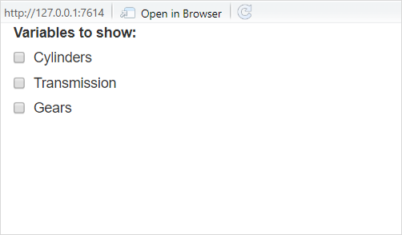
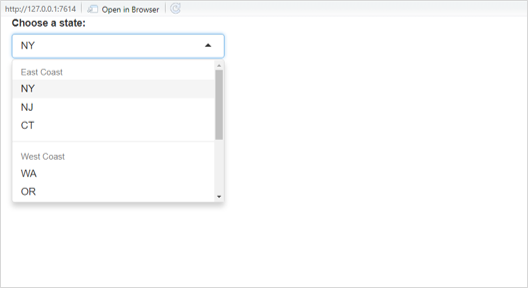
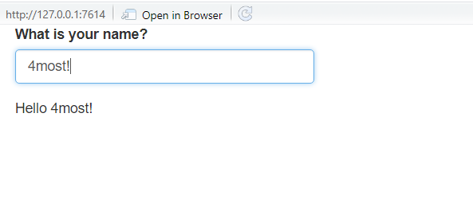
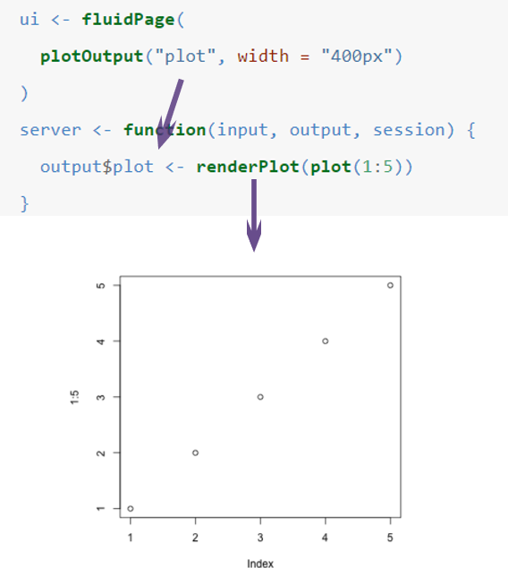

---

---
<style>
@import url('https://fonts.googleapis.com/css?family=Scope+One&display=swap');
@import url('https://fonts.googleapis.com/css?family=Scope+One|Unica+One&display=swap&subset=latin-ext');
@import url('https://fonts.googleapis.com/css?family=Open+Sans&display=swap');

h1,h2 {font-family: 'Unica One', cursive;
  font-size: 25px;}
p2 {font-family: 'Unica One', cursive;
  font-size: 25px;}       
p {font-family: 'Open Sans', sans-serif;
  font-size: 15px;}   
</style>
  ```{r setup, include=FALSE}
knitr::opts_chunk$set(echo = TRUE)
```
&nbsp;  


# Inputs & Outputs {.tabset .tabset-fade}  

## Intro  
&nbsp;  
Ok, we know where to place things and where to tell them what to do - but what can we put in an app??
&nbsp; 

<center>

</center>
&nbsp; 
<br>

<p2>What are Widgets?</p2>
<br>
<p>A widget (or input control) is a web element that you can interact with, such as a button, drop-down list, slider, etc.. If you’ve used the internet, you’ve used a widget!</p>

<p>Widgets will allow you or your users to send requests to the Shiny app. A widget will collect the request whether it’s a value, string, dataset, or a value chosen from a list. When the widget is changed, the output will also change.</p>

<p>You will place and define a widget in the UI. The logic needed to process what will be output is placed in the server.</p>

<p>The widgets shown below are the standard pre-built widgets that come with Shiny. More advanced widgets can be implemented via shinyWidgets or by even creating your own! Also, new libraries are released all the times so do your research before you attempt to reinvent the wheel.</p>
<br>
<center>

</center>
<br>

<p>The standard widget function calls are listed below. There will be a:</p>
<br>

  | Shiny Widgets | Description |
  |:---------:|:---------:|
  | `actionButton( )` | Action button |
  | `checkboxGroupInput( )` | A group of check boxes |
  | `checkboxInput( )` | A single check box |
  | `dateInput( )` | A calendar to aid date selection |
  | `dateRangeInput( )` | A pair of calendars for selecting a date range |
  | `fileInput( )` | A file upload control wizard |
  | `helpText( )` | Help text that can be added to an input form |
  | `numericInput( )` | A field to enter numbers |
  | `radioButtons( )` | A set of radio buttons |
  | `selectInput( )` | A box with choices to select from |
  | `sliderInput( )` | A slider bar |
  | `submitButton( )` | A submit button |
  | `textInput( )` | A field to enter text |

<br>
<p>In the following section, we're going to cover how to code this in both the UI and Server sections of your Shiny app.</p>

## Widgets 101
&nbsp;  

<p2>How to implement widgets/input controls in your Shiny app:</p2>
<br><br>
<p>Each widget will contain the required arguments described below. As a SAS equivalent, think of these as the options a Proc Logistic statement would require (i.e., dependent variable, independent variables) or have as options (i.e. plots, weights, output a scored dataset, etc.).</p>
<ul>
<li><p>**inputid:** This argument is the name that you will use for this widget. It must be unique because it is the 'key' that the server calls on to access the value of the widget. This is very similar to a macro variable in SAS (must be unique and contains a value or string). This argument is always the **first** argument and so using `inputid = ` is typically optional, in case you don't see it in an example you pick up from the internet. (*required arg*)</p></li>
<li><p>**label:** This argument is the text that will appear in the UI alongside the widget. Think of this as the "Please select from list below:" that you could find above a drop-down list. (*required arg*)</p></li>
</ul>

<p>Widgets also contain additional optional arguments (dependent on the kind of widget) which you can or should define. Not all options are valid for certain widgets (i.e., a minimum value is not valid for a drop-down list). Below are only some of the options that are available, for a full list for a particular widget please visit the Shiny documentation site for your particular widget ([Visit here!](https://shiny.rstudio.com/reference/shiny/latest/))</p>
<ul>
<li><p>**min, max:** This option allows you to set the minimum or maximum value that a widget contains. This can be set to be static (i.e., always starts at 1 to 20) or can be set to change dynamically (i.e., the min and max change based on the variable chosen). This will be covered in the reactivity section.</p></li>
<li><p>**value:** This option is the starting value for a particular widget.</p></li>
<li><p>**choices:** This option allows you to define what choices are available for your user to pick from. Like the min/max option, this can be static or dynamic. You are also able to nest options inside of other options (*see example 2*).</p></li>
<li><p>**selected:** This options allows you to choose the default value that is chosen when the control input is first displayed in the UI. Ensure the default value makes sense (i.e., don't set the default date in a date widget as 01/01/1900 for a dataset starting in 1975).</p></li>
</ul>
<br>
<p>The following two examples illustrate how a control widget would be defined in the UI section of your app. For more examples, check out the 'Examples' tab above.</p>
<p>**Example 1**</p>
```{r eval=FALSE, include=TRUE}
  checkboxGroupInput("variable", #ID - You will refer to the value from this widget through this ID
                     #If you choose 'a' then you use the id 'variable' to hold the value 'a' 
                     "Variables to show:", #Text above your checkboxes
                     c("Cylinders" = "cyl", #Options for checkboxes defined in this argument
                       "Transmission" = "am",
                       "Gears" = "gear")),

```
<p>The code will produce the following checkbox options:</p>
<center>

</center>
<br>

<p>**Example 2**</p>
```{r eval=FALSE, include=TRUE}
#The following would be found within the UI code section
selectInput("state", #ID - You will refer to the value from this widget in the server code by this ID
            "Choose a state:", #Text you would see above the widget in the UI
      list(
        `East Coast` = list("NY", "NJ", "CT"), 
        #The options you would give your user under the 'East Coast' option
        `West Coast` = list("WA", "OR", "CA"),
        #The options you would give your user under the 'West Coast' option
        `Midwest` = list("MN", "WI", "IA")
        #The options you would give your user under the 'Midwest' option
        )
```
<p>The code will produce the following drop-down list:</p>
<center>

</center>
<br>

<p2>The Server Connection: render Functions</p2>
<br><br>
<p>Whilst the input controls described are displayed in the UI, they are really designed to send inputs to R and then display an output. What we then need is that inbetween step - telling R what to do with this input so that there is something to display. For this input to actually do something, such as plotting a graph or running a model on a training set, we define the logic in the server section of the Shiny app. This is where the server really shines!</p>

<p>Until now we've only mentioned that the server code holds logic that is applied to the inputs from the control widgets described. However, the server is **actually a function** that holds a list of inputs and a list of outputs. It is why the server logic is initially defined as `server <- function(input, output){#logic }`. </p>

<p>When app is run and the server function is called, each input value from the control widgets is placed in the input list of the server function. Each input value is referenced by the Input ID we give to each one the control widgets (i.e., in example 2 we use the ID "state" which would be passed to the server in the input list). This input list will change as your end user changes the widget.</p>

<p>Once you have your inputs, the server renders an output list and the assigned values based on what logic/code you've placed in the server section of your app. Outputs coming from the server are defined in the server logic using the following convention - `output$outputID`. This output can then be displayed in the UI.</p>

<p>Let's walk through the following example:</p>
<ul>
<li><p>Text input control with input ID 'username' is created and displayed in the app.</p></li>
<li><p>A user types in '4most'. Now the input with ID 'username' has a value of '4most'.</p></li>
<li><p>This value is passed to the server in the input list.</p></li>
<li><p>This value is processed using renderText as you plan on displaying output text.</p></li>
<li><p>Based on the server logic, the output value is then "Hello 4most" which is assigned to the output list with the ID 'message'. Like inputs, this is similar to storing values in a SAS macro variable. The only difference is that the value stored is as the result of processing.</p></li>
<li><p>The output with ID 'message' can now be displayed in the UI (next section!).</p></li>
</ul>
```{r eval=FALSE, include=TRUE}
ui <- fluidPage(
        textInput(inputid = "username", #Input ID of "username"
                  label = "What is your name?"), 
        textOutput("message") #Displays the renderText assigned to output$message in the UI
        #The output is only possible because of the server logic
)

server <- function(input, output){
  output$message <- renderText({  #message is the output ID of what is produced in the renderText
    #renderText is used because text is what we wish to display as output in the UI
    my_greeting <- "Hello "
    #Calls on created string 'my_greeting and input ID "username"
    message_str <- paste0(my_greeting, input$username) 
    message_str #Returns message_str, the command above only creates it
  })
}
```
<br>
<p>This will output the following app:</p>
<center>

</center>
<br>
<p>One last thing to note before going back to the UI - the type of output you wish to display in the UI determines the type of render function you use to process any inputs. For example, if you wish for the server to plot some variables from a dataset and then display it in the UI, you will want to use  `renderPlot( )` and so on. See the table below for more render functions you can use in the server.</p>

  | Render Functions | Content Type |
  |:---------:|:---------:|
  | `renderText( )` | Unformatted text |
  | `renderTable( )` | Simple data table |
  | `renderDataTable( )` | Interactive data table (uses the DT library) |
  | `renderPlot( )` | Graphical plot (used with `ggplot2( )`) |
  | `renderPlotly( )` | Interactive Plotly plot |
  | `renderLeaflet( )` | Interactive Leaflet map |
  | `renderPrint( )` | Any output used with `print( )` |

<p>This is not exhaustive! These are simply very common output types. We will cover more when we go over reactivity in more depth.</p>  
<br>  

<p2>What about Output functions? How are they different to input controls?</p2>
<br><br>
<p>Alrighty then, we've created some inputs, processed them in the server and now we have some outputs. What now? Well, now we need to display them! This is where output functions (in the UI) enter the scene...</p>

<p>Remember how the server function creates an output list where each value has an ID? Yes that's right, we're going to use them now! Use the IDs of these outputs in the following output functions. This will display the output in the section of your interface where you've placed the output functions (i.e., if you place the output function within your second tab, it will output content to the second tab).</p>

  | Output Functions | Content Type |
  |:---------:|:---------:|
  | `textOutput( )` | Unformatted text |
  | `tableOutput( )` | Simple data table |
  | `dataTableOutput( )` | Interactive data table (uses the DT library) |
  | `plotOutput( )` | Graphical plot (used with `ggplot2( )`) |
  | `plotlyOutput( )` | Interactive Plotly plot |
  | `leafletOutput( )` | Interactive Leaflet map |
  | `verbatimTextOutput( )` | Any output used with `print( )` |

<p>Similar to the previous table of render functions, this is not an exhaustive list of output functions!</p>

<p>See below for an example of the process:</p>
<center>
<div style="width:50%; height:30%">

</center>
<br>


## Examples  

&nbsp;  
<p2>Widget examples</p2>
<p>Embedded below is a shiny app that you can interact with! It contains some of the key widgets/control inputs you will use when building an app.If you would like to open it in a separate window - [Click here!](https://4-most.shinyapps.io/Example_file/)</p>

<center>
<iframe width="100%" height="1000px" src="https://4-most.shinyapps.io/Example_file/" scrolling= "yes"></iframe>  
</center>  


<br> <br>


## Practice  

&nbsp;  
<p2>Practice problems</p2>  
<p>Uncomment the code below and see if you can create the widget! If you would like to open the app in a separate window - [Click here!](https://4-most.shinyapps.io/Other_testing1/)</p>

<center>
<iframe width="100%" height="550" src="https://4-most.shinyapps.io/Other_testing1/" scrolling= "yes"></iframe> </center>  

## Checkpoint 3

&nbsp;  
<center>

</center>
&nbsp;  


## Advanced Widgets

&nbsp;  
<p2>Interested in more advanced widgets?</p2>
<br><br>
<p>Check out the following:</p>
<ul>
<li><p>[shinyWidgets:](https://github.com/dreamRs/shinyWidgets)</p></li>
<li><p>[HTML Widgets for R:](https://github.com/ramnathv/htmlwidgets) Learn to create your own widgets. This is an advanced topic so don't get discouraged!</p></li>
<li><p>[JavaScript Widgets:](https://shiny.rstudio.com/articles/js-build-widget.html) Start building a widget in javascript.</p></li>
</ul>


  